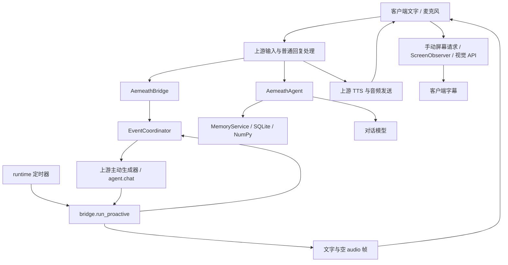

# Aemeath 技术架构与模块组织

更新：2026-09-12。依据 [需求](requirements.md)。用户已确认首期方向及本地记忆约束。

**实现状态**：底座已固定并实测启动通过（见 [上游版本](upstream.md)、[启动手册](runbook.md)）；
首期逻辑模块已在 `aemeath/` 下实现并有自动化测试覆盖（见 [验收记录](acceptance.md)）。
真实对话、提取、屏幕捕获及视觉理解已有通过记录；嵌入阻塞，麦克风与完整主动交流尚未验收。
本轮核心代码复盘发现的实现缺口见文末；自动化覆盖不表示所有设计链路已经闭合。

## 已确认方向

首期以 Open-LLM-VTuber 的桌面与语音链路为验证底座，连接 Aemeath 独立的角色决策、记忆和状态服务。AIRI 保留为替代候选；若验证发现底座不能满足首期验收，再记录原因并调整，不同时维护两套角色运行时。

逻辑模块：桌面表现与输入 → 事件汇聚 → 情境/角色状态 → 决策协调 → 文字、语音、动作或电脑工具 → 结果观察。记忆为决策提供相关经历；定时器提供作息与提醒事件。统一协调用户消息、主动搭话和工具行动，避免多个模块同时抢话或操作。

Python 服务适合衔接 MaiBot 思路与现有语音生态；桌面端技术随候选客户端验证确定。模型提供商通过接口替换，按对话、视觉、提取、嵌入、ASR、TTS 分配，不假定一个 API 支持全部能力。

## 记忆与角色

当前本地数据库保存事实、来源、时间、历史修订、经历摘要与情境状态；提醒及完整生活状态仍是后续设计。首期已实现 SQLite 加 NumPy 向量检索，全文检索尚未实现，不作为当前降级能力。提醒使用确定的时间与状态，不依赖模型偶然想起。

本地存储是明确约束：聊天历史、记忆正文、向量索引及备份均留在用户电脑。计划使用 `data/` 保存本机数据库和索引，`data/backups/` 保存本地备份；不入源码版本管理，不启用云同步。云端记忆平台、远程向量数据库不作为依赖；若选 Mem0，仅评估配置本地存储的开源组件，不使用其托管记忆服务。

处理流程：本地检索相关片段 → 将本次必要输入发送给模型 API → 校验结构化结果 → 回写本地数据库。对话 API 不充当权威记忆库，不上传整库作为同步手段。纠正和删除需同步处理正文与索引；备份恢复不得悄悄恢复已删除记忆，恢复规则在实现时明确。模型提供商的输入留存另按服务条款与配置核对，不能把本地保存描述成云端零留存。

设计上，稳定人设、短期情绪、生活状态、用户事实、学习到的表达方式应分别保存。黑话保留含义、适用上下文与证据，不能因学习一句话就改写核心性格。角色可有一致的行动倾向，但模型的判断不等于可靠执行；电脑动作须观察结果。

API 可用于记忆提取、摘要和嵌入，本地嵌入仅为可选方案。嵌入模型切换需重建索引，不能混用不兼容向量。

## 感知与行动

建议以窗口变化、用户消息和定时事件触发，按需截图送视觉 API；不默认持续高频上传屏幕。课堂静音作为持久状态约束输出。恢复播放时间和作息规则待定。

后续电脑控制优先应用 API 或 Windows 可访问性接口，必要时图像定位。行动记录目标、执行结果与简要理由；执行过程中确认窗口与对象，保存成功后才关闭。Windows-MCP 是候选执行接口，不提供角色价值判断本身。具体自主行动范围由后续场景约定确定。

## 计划目录与验证

在计划目录基础上，实际落地的结构为：

| 位置 | 内容 |
| --- | --- |
| `aemeath/` | Aemeath 核心模块（见下表） |
| `vendor/Open-LLM-VTuber/` | 固定上游 v1.2.1，整体保持原样，不入版本管理 |
| `vendor/Open-LLM-VTuber-Web/` | 客户端源码（固定 `d176e7d`），构建后部署到上游 `frontend/` |
| `config/conf.aemeath.yaml` | 权威配置，不含密钥 |
| `scripts/` | 启动、配置检查、环境设置、迁移与协议核查 |
| `tests/` | 模块单元测试与替身 |
| `tests/integration/` | **生产入口**集成测试（见 [验收记录](acceptance.md)） |
| `data/`、`logs/` | 本机数据与日志，不入版本管理 |
| `docs/patches/` | 上游补丁与套用顺序 |

模块职责（对应本文档上节的逻辑模块）：

| 模块 | 文件 | 职责 |
| --- | --- | --- |
| **桥接层** | `bridge.py` | 上游与 Aemeath 的唯一接缝：协议扩展、轮次接入、输出闸门 |
| 事件协调 | `coordinator.py` | 单轮仲裁、取消、用户优先、输出闸门 |
| 情境状态 | `situation.py` | 普通/课堂模式、开关、持久化、**状态版本** |
| 角色对话 | `agent.py`、`prompts.py` | 组装人设/情境/记忆，流式输出与打断 |
| 本地记忆 | `memory.py` | SQLite + NumPy 检索、证据片段、精确遗忘、版本校验 |
| 屏幕观察 | `screen.py` | 前台窗口捕获、节流、摘要时效、观察代次 |
| 主动调度 | `proactive.py` | 冷却、频次、不回应暂停等资格规则 |
| 模型适配 | `adapters.py` | 嵌入、提取、视觉、**显式能力工厂** |
| 历史导入 | `legacy.py` | 旧 JSON 历史一次性幂等导入 |
| 运行时 | `runtime.py` | 装配各模块、能力状态、后台任务、指标与用量 |
| 接口约定 | `interfaces.py` | 事件、情境、输出、记忆、屏幕的类型 |

## 桥接层与运行链路

实际链路：

```
桌面客户端
→ 上游连接与输入处理
→ AemeathBridge
→ coordinator
→ Agent / memory / screen / scheduler
→ 输出桥接与 TTS
→ 桌面显示、播放和回执
```

职责固定：

- coordinator 唯一管理轮次、取消和输出许可。
- Agent 只组织上下文和生成，每轮读取当前情境，不长期保存状态对象
  （状态更新会替换对象，继续保存旧引用会导致旧状态残留）。
- runtime 持有情境管理器、适配器、记忆服务与后台任务；退出时统一取消并等待。
- 上游复用 ASR、TTS 和角色渲染，但 Aemeath 分支不绕过自己的输入、输出与历史管理。
- 非 Aemeath Agent 保持原有行为。

出站帧一律携带 `generation`、`turn_id`、`audio_slice_id`、`state_version`，
客户端据此拒绝迟到或已失效的输出。连接时协商协议版本（当前为 2），
未协商到该版本的客户端不作为完整 Aemeath 客户端运行。

不为此规划创建空目录：`app/`、`services/`、`adapters/` 未单独建立，
其职责分别落在 `aemeath/` 内部与上游客户端。

验证依次覆盖文字/语音往返和打断、屏幕理解、课堂静音、跨启动记忆和纠正、主动搭话节奏。
后续保存关闭与平台发送先用隔离窗口及替身验证，再在明确的真实场景验收。
文档检查不代替运行验证。

## 2026-09-11 技术初查

本轮搜索 GitHub 仓库并读取官方 README；仅为文档和局部源码审阅，不能据此认定稳定性满足本项目。

| 候选 | 已读依据与适用处 | 限制 |
| --- | --- | --- |
| [Open-LLM-VTuber](https://github.com/Open-LLM-VTuber/Open-LLM-VTuber) | README 描述 Windows、透明桌宠、Live2D、视觉、语音打断、多个 API 后端与 Agent 接口 | README 明确长期记忆暂时移除；需自行接入。卧室动作与通用电脑控制未验证 |
| [AIRI](https://github.com/moeru-ai/airi) | README 描述 Windows 桌面、实时语音、VRM/Live2D 生态，方向接近 Neuro | 所读 README 仍将 Memory Alaya 标为 WIP；发布链接含 beta，不能视为完整成熟成品 |
| [Mem0](https://github.com/mem0ai/mem0) | README 提供用户/会话/Agent 记忆与 SDK，默认使用云端 LLM、embedding，支持替换 | 不包含完整角色生活与提醒机制；中文效果、成本、依赖尚未测试 |
| [Windows-MCP](https://github.com/CursorTouch/Windows-MCP) | README 提供 Windows 应用控制、文件导航与 UI 交互 | QQ/微信原生语音和各软件可靠保存须分别验证 |

本地审阅 `大肥鱼/MaiBot-1.2.4/src/services/memory_service.py`、`src/learners/expression_learner.py`、`src/learners/jargon_learner.py`：记忆通过 A_memorix 宿主服务调用；表达学习依赖数据库、向量索引、会话及 LLM 服务；黑话学习保留来源并调用学习模型。适合参考设计，不是直接复制即可独立运行的模块。大肥鱼项目规则明确当前暂停学习型风格使用和更新，因此代码存在不代表其在大肥鱼已验证良好运行。

正式复用源码前核对具体版本、许可证和依赖边界；本轮未复制上游代码或用户数据。

## 后续实施待定

首期继续使用固定底座，SQLite 与 NumPy 已落地。嵌入供应商、API ASR/TTS、预算、声音和正式角色素材仍有待解决项。实施顺序见 [实施计划](implementation-plan.md)，项目规则见 [AGENTS.md](../AGENTS.md)。

## 2026-09-12 核心链路复盘

基线为本机当日工作树，包含本轮开始前已有的未提交代码和验收文件；上层仓库 HEAD 为
`f7f634d`，不能单独代表当前 Aemeath 实现。复盘未修改业务代码、上游副本或服务状态。
覆盖配置装配、Agent 提示词入口、桥接、协调、主动调度、屏幕缓存、记忆检索，以及上游主动生成器和客户端摘要处理。
未覆盖全部上游代码、音频设备、桌面打包、性能实测和真实供应商重新连通；下面区分源码证据与隔离复现。

继续保留 Open-LLM-VTuber v1.2.1。现有 GitHub 初查及 [许可与版本](upstream.md) 仍用于固定底座的复用依据；
本轮没有新的底座需求或替换证据，没有重做线上候选维护状态调查，也不把历史调研当作最新调查。
当前问题集中在接入与生命周期，优先局部修复；不新增服务拆分、远程记忆组件或第二套角色运行时。

### 实际数据流与设计差距



图表示所读运行调用；屏幕摘要到主动提示词的连接尚未找到。
`runtime.start()` 仅启动记忆和主动两个任务，`_observe_on()` 只增加观察代次；
`service_context._generate()` 只放主动提示文本，`AemeathAgent._build_messages()` 不读取 `current_summary()`。
客户端 `websocket-handler.tsx` 的 `aemeath-screen-summary` 分支只调用 `setSubtitleText()`。
因此“屏幕理解通过”和“能结合屏幕主动交流”必须分别验收。

### 优先发现与验证

| 编号 | 证据与影响 | 建议、成本与验证 |
| --- | --- | --- |
| A01 / 已修复（T01） | `bridge.deliver_proactive()` 调用 `send_audio(turn_id, "", ...)`；上游 `_install_aemeath_proactive_generator()` 只收集显示文本，不执行 TTS。隔离调用得到 `audio_payloads=[""]`，不能形成可听主动语音 | 中等改动：主动输出复用普通回复的合成和发送流程，统一轮次标识；验证非空可解码音频、打断与课堂切换，随后真人听验 |
| A02 / 已修复（T01） | `coordinator.run_proactive()` 在送达前 `mark_spoken()`；`bridge.on_display_receipt()` 再调用一次。隔离探针一次搭话回执前计数 1，回执后 2，会提前消耗频次且把未显示消息算作已发送 | 小到中等改动：回执作为唯一计数入口，处理重复／丢失回执；从 `bridge.run_proactive()` 起测，不能只测 `deliver_proactive()` |
| A03 / 优先修复 | `ScreenObserver.observe()` 在等待视觉响应后直接写 `_latest`；`reset()` 未改变可在返回时核对的代次。隔离探针在等待中 reset，再释放响应，`current_summary()` 仍非空。桥接拒绝外发不等于内部缓存未写回 | 小改动：观察器在 await 前后校验代次，关闭后缓存也保持空；增加关闭中返回、重新开启后旧请求返回的回归 |
| A04 / 首期缺口 | 屏幕自动观察及摘要进入主动对话的连接缺失，证据见上节。手动请求成功不能满足 R05 | 中等改动：在统一调度下按需观察，生成时携带有效摘要与来源；发送前重检开关、窗口和用户活动。验证不点击按钮也能结合隔离窗口内容搭话，过期／关闭信息不进入模型 |
| A05 / 已修复（T01） | 主动生成器仍有 `from open_llm_vtuber.agent.input_types import ...`，与项目 `src.open_llm_vtuber.*` 约定不符。此处类型混用的具体运行影响未复现，不直接等同于此前回复丢弃故障 | 小改动：修复导入并核对补丁与工作副本一致；通过真实 `service_context` 生成器入口验证，不以替身生成器代替 |

复现方法（均为内存替身，无 API、真实截图、数据库写入或音频播放）：

- A01/A02：真实 `ProactiveScheduler`、`EventCoordinator` 与 `AemeathBridge`，替身情境和 sender，安装返回固定文本的生成器，调用 `bridge.run_proactive()`，记录音频字段及回执前后的调度历史长度。
- A03：真实 `ScreenObserver`，替身前台窗口、内存 PNG 与可暂停的视觉适配器；启动 `observe(force=True)`，在视觉等待中 `reset()`，释放响应后检查 `current_summary()`。
- 初次主动探针的情境替身缺少 `state_version` 而报错；补齐替身接口后复现 A01/A02。该探针构造错误不计为产品缺陷。

现有 `test_vision_result_discarded_after_observation_disabled` 应同时检查外发帧和观察器缓存；当前相关测试只断言返回值和外发帧，另一个 reset 测试在请求结束后关闭，未覆盖上述交错。
生产入口测试应覆盖跨模块不变量，不能由多个局部通过推断整条链路成立。

### A01 / A02 / A05 的修复（T01，2026-09-13）

修复落在接入层，未改动 `aemeath/screen.py`，**T02 的屏幕缓存修复保持独立**。

- **A01**：主动输出改走 `coordinator.emit_proactive()`，与普通回复共用输出闸门；
  桥接通过 `attach_tts_engine()` 持有上游合成引擎，用同一个
  `prepare_audio_payload()` 生成真实音频帧。上游补丁在 `init_tts()` 与
  `init_agent()` 两处附加引擎，取最后生效的一方。
- **A02**：`run_proactive()` 只返回候选、不再 `mark_spoken()`；
  `on_display_receipt()` 成为唯一计数入口，重复与迟到回执都是空操作。
  同时 `end_turn()` 现在会让轮次退休，使已结束轮次的迟到音频通不过
  `may_send_audio()`；此前只有“活动轮次被顶替”才会进入取消集合。
- **A05**：生成器导入改为 `src.open_llm_vtuber.agent.input_types`，
  四个补丁对干净 `v1.2.1`（`3afa410`）重新验证：全部 `git apply --check` 通过，
  套用后 8 个受影响文件与工作副本**逐字节一致**。

回归测试在 `tests/integration/test_proactive_voice.py`，经真实上游生成器入口
（`ServiceContext._install_aemeath_proactive_generator()`）驱动，
只替换模型、TTS 引擎与音频接收端；计数从 `bridge.run_proactive()` 起测。
覆盖课堂静音（含生成中切换）、取消、断线、用户插话、生成中关闭开关、
重复／丢失回执、发送失败与静默标记。

两处接入风险另有针对性回归（经变异验证：改坏实现即失败）：

- **TTS 引擎归属**：`ServiceContext` 每个 WebSocket 会话克隆一份，
  桥接却是进程级单例，因此引擎归属不是显然正确的。补丁在 `init_tts()` 与
  `init_agent()` 两处附加，最后完成的一方生效；不变式是桥接**始终持有可用引擎**。
  测试覆盖重连（会话上下文消失、引擎仍在）与第二个会话上下文接入后仍能出声。
  已知限制：桥接只能持有一个引擎，多会话并发时后接入者覆盖先接入者；
  当前产品是单客户端模型（新连接接管旧连接），因此不构成缺陷。
- **`end_turn` 与音频发送的先后**：桥接必须先发完文字与音频、再退休轮次。
  若顺序颠倒，本轮刚产生的音频会通不过 `may_send_audio()` 而被丢弃，
  表现为"生成了却什么都没送达"。`test_audio_is_sent_before_the_turn_is_retired`
  专门锁定这个顺序，另有"已退休轮次拒绝后续音频"与"普通回复不继承主动轮次退休"。

**仍未验证**：真人听感与真实设备播放（T05 承接）。

### 后续与暂不处理

`MemoryStore.recall()` 在嵌入未配置时返回空列表，Agent 只在异常时标记检索不可用；
“没有相关记忆”与“无法检索”的状态语义应在记忆接入任务中明确，并验证客户端和提示词不会误导。
SQLite 连接管理与来源片段删除已有修复，暂不重写存储层。
取消集合及轮次记录的长期增长可在持续试用中观察；本轮没有内存或性能测量，不据此宣布性能缺陷。
实施、回归和真实体验的完成条件统一在 [实施计划](implementation-plan.md)，本节建议尚未落地。
