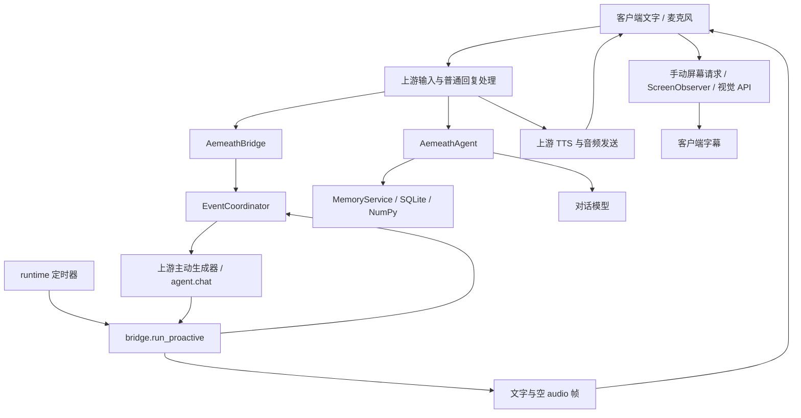
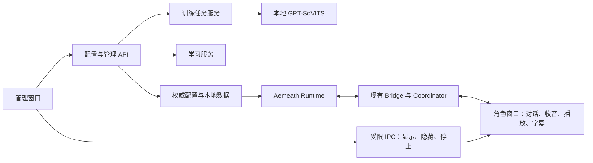

# Aemeath 技术架构与模块组织

## v2.1 Live2D 实施前评审（2026-09-14）

依据：需求 V21-01–V21-05、V2-06–V2-08；规划代码基线 `5e0f25a` 与选定 v4 立绘。[制作契约](live2d-production.md) 为本架构指定的资产目录、图层、参数与交付契约。此处为设计与源码评审，不是运行验收。

| 发现与证据 | 影响和处理 | 是否阻塞 |
| --- | --- | --- |
| v4 为 RGB，生成式抠图未产生 alpha | 先验证真实透明、图层保存及 PSD 导入，完整拆层不能建立在伪透明图片上 | V21-T01 阻塞 T02／T03，不阻塞 v2 |
| 编辑器文件存在，未验证启动、编辑模式或自动操作接口 | 用少量脸部图层验证保存、重开、导出与客户端 Core 加载，明确可自动／需人工步骤 | V21-T01 技术门槛 |
| `live2d.py` 仅检查 model3.json 存在，正式身份固定 false | 接入时验证引用文件、纹理和实际加载，正式身份与验收包关联，不另建管理系统 | V21-T04 中解决 |
| `lappmodel.ts` 已叠加呼吸、视线及读取 EyeBlink／LipSync | 固定参数组、默认闭嘴及驱动优先级，排查物理／待机／音频互相覆盖 | T03 增量加载，T04 真播放验证 |
| v2 窗口与字幕由 #16 交付 | 资产生产独立，桌面接入单向等待 #15、#16，不改 v2 无模型边界 | 仅 T04／T05 依赖 |
| 2026-09-17 复盘：导出包参数零绑定，verify 对它报 8 PASS（假绿灯） | verify 只查文件存在和版本号，不查参数绑定与顶点驱动；必须补 subprocess 调 probe 的"参数有绑定"检查项，断言 exit 0 且 displacement>0，不许吞 returncode | V21-T01 验收缺口，须在 #21 修复 |
| 2026-09-17 复盘：Cubism GUI 绑定无 CLI 自动化路径，8 个诊断脚本均失败 | 导入 PSD、建变形器、导出 moc3 三步明确隔离为人工操作，不再尝试脚本驱动 GUI；agent 只负责验证脚本补严与痕迹清理 | 不阻塞，但改任务分工 |

结论：采用“本地美术工程 → Cubism 运行包 → 现有管理配置 → 唯一桌面会话”的流程，无需新建渲染器、音频通道或模型服务。按技术小样、完整分层、绑定导出、桌面接入、整体验收顺序可实施，先通过技术门槛再开展后续生产。

并行边界：v2 维护管理 API、Electron 窗口、字幕与通用补丁；v2.1 T01–T03 仅维护资产和制作契约，不改共享运行配置。T04 同步已验收的 v2 接口，在独立 worktree 顺序落地最小接入改动及补丁，不覆盖其他任务未提交内容。正式角色交付不依赖 v2 学习或训练任务，也不改变其状态。

v2 的新增设计与实施前评审见本文末尾“v2 管理与桌面增量设计”。原有章节记录首期与历史方案；历史待办不能覆盖较新的交付记录和本轮需求。

更新：2026-09-12。依据 [需求](requirements.md)。用户已确认首期方向及本地记忆约束。

**实现状态**：底座已固定并实测启动通过（见 [上游版本](upstream.md)、[启动手册](runbook.md)）；
首期逻辑模块已在 `aemeath/` 下实现并有自动化测试覆盖（见 [验收记录](acceptance.md)）。
真实对话、提取、屏幕捕获、视觉理解、本地嵌入与真实长期记忆、本地 SenseVoice／GPT-SoVITS 语音链路均已有通过记录，其中语音与记忆的最新证据见 [验收记录第十五节](acceptance.md#十五首期验收缺口修复与收口推进记录2026-09-13)。现场锁屏采录与两次真人试用经用户确认延期，状态见 [交付记录](delivery.md)；延期不等于通过。
本轮核心代码复盘发现的实现缺口见文末；自动化覆盖不表示所有设计链路已经闭合。

## 已确认方向

首期以 Open-LLM-VTuber 的桌面与语音链路为验证底座，连接 Aemeath 独立的角色决策、记忆和状态服务。AIRI 保留为替代候选；若验证发现底座不能满足首期验收，再记录原因并调整，不同时维护两套角色运行时。

逻辑模块：桌面表现与输入 → 事件汇聚 → 情境/角色状态 → 决策协调 → 文字、语音、动作或电脑工具 → 结果观察。记忆为决策提供相关经历；定时器提供作息与提醒事件。统一协调用户消息、主动搭话和工具行动，避免多个模块同时抢话或操作。

Python 服务适合衔接 MaiBot 思路与现有语音生态；桌面端技术随候选客户端验证确定。模型提供商通过接口替换，按对话、视觉、提取、嵌入、ASR、TTS 分配，不假定一个 API 支持全部能力。

**语音方案调整（2026-09-13 用户确认，见 [需求](requirements.md)）**：
1. **ASR 首期目标改为本地 SenseVoice**：基于 sherpa-onnx 在本机离线运行（使用 SenseVoice int8 模型），解决外部 API ASR 缺失问题。保留原有识别准确率、打断、静音及延迟验收要求。
2. **TTS 正式方案为本地 GPT-SoVITS**：它作为本机 HTTP 服务（默认 `http://127.0.0.1:9880/tts`，api_v2 接口）运行，Aemeath 与上游引擎都按 HTTP 客户端调用它。目标是固定角色音色。参考音频暂缺，首期先不做角色音色与听感验收。
3. 语音推理与转写均在本机执行，音频与模型不出本机，完全符合本地数据边界约束。其余能力（对话、视觉、提取、嵌入）仍按外部 API 方案。

## 记忆与角色

当前本地数据库保存事实、来源、时间、历史修订、经历摘要与情境状态；提醒及完整生活状态仍是后续设计。首期已实现 SQLite 加 NumPy 向量检索，全文检索尚未实现，不作为当前降级能力。提醒使用确定的时间与状态，不依赖模型偶然想起。

本地存储是明确约束：聊天历史、记忆正文、向量索引及备份均留在用户电脑。计划使用 `data/` 保存本机数据库和索引，`data/backups/` 保存本地备份；不入源码版本管理，不启用云同步。云端记忆平台、远程向量数据库不作为依赖；若选 Mem0，仅评估配置本地存储的开源组件，不使用其托管记忆服务。

处理流程：本地检索相关片段 → 将本次必要输入发送给模型 API → 校验结构化结果 → 回写本地数据库。对话 API 不充当权威记忆库，不上传整库作为同步手段。纠正和删除需同步处理正文与索引；备份恢复不得悄悄恢复已删除记忆，恢复规则在实现时明确。模型提供商的输入留存另按服务条款与配置核对，不能把本地保存描述成云端零留存。

设计上，稳定人设、短期情绪、生活状态、用户事实、学习到的表达方式应分别保存。黑话保留含义、适用上下文与证据，不能因学习一句话就改写核心性格。角色可有一致的行动倾向，但模型的判断不等于可靠执行；电脑动作须观察结果。

API 可用于记忆提取、摘要和嵌入，本地嵌入仅为可选方案。嵌入模型切换需重建索引，不能混用不兼容向量。
实际采用的对话与提取提供方在本机服务上运行，原始请求仍经外部模型 API：按上段要求只发送本次处理所需输入，**本机服务不等于零留存**。该运行方式已运行验证，但未做网络留存审计，也不改变“记忆正文与索引留在本机”的边界。

## 感知与行动

建议以窗口变化、用户消息和定时事件触发，按需截图送视觉 API；不默认持续高频上传屏幕。课堂静音作为持久状态约束输出。恢复播放时间和作息规则待定。

后续电脑控制优先应用 API 或 Windows 可访问性接口，必要时图像定位。行动记录目标、执行结果与简要理由；执行过程中确认窗口与对象，保存成功后才关闭。Windows-MCP 是候选执行接口，不提供角色价值判断本身。具体自主行动范围由后续场景约定确定。

## 计划目录与验证

在计划目录基础上，实际落地的结构为：

| 位置 | 内容 |
| --- | --- |
| `aemeath/` | Aemeath 核心模块（见下表） |
| `vendor/Open-LLM-VTuber/` | 固定上游 v1.2.1，整体保持原样，不入版本管理 |
| `vendor/Open-LLM-VTuber-Web/` | 客户端源码（固定 `d176e7d`），构建后部署到上游 `frontend/` |
| `config/conf.aemeath.yaml` | 权威配置，不含密钥 |
| `scripts/` | 启动、配置检查、环境设置、迁移与协议核查 |
| `tests/` | 模块单元测试与替身 |
| `tests/integration/` | **生产入口**集成测试（见 [验收记录](acceptance.md)） |
| `data/`、`logs/` | 本机数据与日志，不入版本管理 |
| `docs/patches/` | 上游补丁与套用顺序 |

模块职责（对应本文档上节的逻辑模块）：

| 模块 | 文件 | 职责 |
| --- | --- | --- |
| **桥接层** | `bridge.py` | 上游与 Aemeath 的唯一接缝：协议扩展、轮次接入、输出闸门 |
| 事件协调 | `coordinator.py` | 单轮仲裁、取消、用户优先、输出闸门 |
| 情境状态 | `situation.py` | 普通/课堂模式、开关、持久化、**状态版本** |
| 角色对话 | `agent.py`、`prompts.py` | 组装人设/情境/记忆，流式输出与打断 |
| 本地记忆 | `memory.py` | SQLite + NumPy 检索、证据片段、精确遗忘、版本校验 |
| 屏幕观察 | `screen.py` | 前台窗口捕获、节流、摘要时效、观察代次 |
| 主动调度 | `proactive.py` | 冷却、频次、不回应暂停等资格规则 |
| 模型适配 | `adapters.py` | 嵌入、提取、视觉、**显式能力工厂** |
| 历史导入 | `legacy.py` | 旧 JSON 历史一次性幂等导入 |
| 运行时 | `runtime.py` | 装配各模块、能力状态、后台任务、指标与用量 |
| 接口约定 | `interfaces.py` | 事件、情境、输出、记忆、屏幕的类型 |

## 桥接层与运行链路

实际链路：

```
桌面客户端
→ 上游连接与输入处理
→ AemeathBridge
→ coordinator
→ Agent / memory / screen / scheduler
→ 输出桥接与 TTS
→ 桌面显示、播放和回执
```

职责固定：

- coordinator 唯一管理轮次、取消和输出许可。
- Agent 只组织上下文和生成，每轮读取当前情境，不长期保存状态对象
  （状态更新会替换对象，继续保存旧引用会导致旧状态残留）。
- runtime 持有情境管理器、适配器、记忆服务与后台任务；退出时统一取消并等待。
- 上游复用 ASR、TTS 和角色渲染，但 Aemeath 分支不绕过自己的输入、输出与历史管理。
- 非 Aemeath Agent 保持原有行为。

出站帧一律携带 `generation`、`turn_id`、`audio_slice_id`、`state_version`，
客户端据此拒绝迟到或已失效的输出。连接时协商协议版本（当前为 2），
未协商到该版本的客户端不作为完整 Aemeath 客户端运行。

不为此规划创建空目录：`app/`、`services/`、`adapters/` 未单独建立，
其职责分别落在 `aemeath/` 内部与上游客户端。

验证依次覆盖文字/语音往返和打断、屏幕理解、课堂静音、跨启动记忆和纠正、主动搭话节奏。
后续保存关闭与平台发送先用隔离窗口及替身验证，再在明确的真实场景验收。
文档检查不代替运行验证。

## 2026-09-11 技术初查

本轮搜索 GitHub 仓库并读取官方 README；仅为文档和局部源码审阅，不能据此认定稳定性满足本项目。

| 候选 | 已读依据与适用处 | 限制 |
| --- | --- | --- |
| [Open-LLM-VTuber](https://github.com/Open-LLM-VTuber/Open-LLM-VTuber) | README 描述 Windows、透明桌宠、Live2D、视觉、语音打断、多个 API 后端与 Agent 接口 | README 明确长期记忆暂时移除；需自行接入。卧室动作与通用电脑控制未验证 |
| [AIRI](https://github.com/moeru-ai/airi) | README 描述 Windows 桌面、实时语音、VRM/Live2D 生态，方向接近 Neuro | 所读 README 仍将 Memory Alaya 标为 WIP；发布链接含 beta，不能视为完整成熟成品 |
| [Mem0](https://github.com/mem0ai/mem0) | README 提供用户/会话/Agent 记忆与 SDK，默认使用云端 LLM、embedding，支持替换 | 不包含完整角色生活与提醒机制；中文效果、成本、依赖尚未测试 |
| [Windows-MCP](https://github.com/CursorTouch/Windows-MCP) | README 提供 Windows 应用控制、文件导航与 UI 交互 | QQ/微信原生语音和各软件可靠保存须分别验证 |

本地审阅 `大肥鱼/MaiBot-1.2.4/src/services/memory_service.py`、`src/learners/expression_learner.py`、`src/learners/jargon_learner.py`：记忆通过 A_memorix 宿主服务调用；表达学习依赖数据库、向量索引、会话及 LLM 服务；黑话学习保留来源并调用学习模型。适合参考设计，不是直接复制即可独立运行的模块。大肥鱼项目规则明确当前暂停学习型风格使用和更新，因此代码存在不代表其在大肥鱼已验证良好运行。

正式复用源码前核对具体版本、许可证和依赖边界；本轮未复制上游代码或用户数据。

## 后续实施待定

首期继续使用固定底座，SQLite 与 NumPy 已落地。嵌入供应商、API ASR/TTS、预算、声音和正式角色素材仍有待解决项。实施顺序见 [实施计划](implementation-plan.md)，项目规则见 [AGENTS.md](../AGENTS.md)。

## 2026-09-12 核心链路复盘

基线为本机当日工作树，包含本轮开始前已有的未提交代码和验收文件；上层仓库 HEAD 为
`f7f634d`，不能单独代表当前 Aemeath 实现。复盘未修改业务代码、上游副本或服务状态。
覆盖配置装配、Agent 提示词入口、桥接、协调、主动调度、屏幕缓存、记忆检索，以及上游主动生成器和客户端摘要处理。
未覆盖全部上游代码、音频设备、桌面打包、性能实测和真实供应商重新连通；下面区分源码证据与隔离复现。

继续保留 Open-LLM-VTuber v1.2.1。现有 GitHub 初查及 [许可与版本](upstream.md) 仍用于固定底座的复用依据；
本轮没有新的底座需求或替换证据，没有重做线上候选维护状态调查，也不把历史调研当作最新调查。
当前问题集中在接入与生命周期，优先局部修复；不新增服务拆分、远程记忆组件或第二套角色运行时。

### 实际数据流与设计差距



图表示所读运行调用；屏幕摘要到主动提示词的连接尚未找到。
`runtime.start()` 仅启动记忆和主动两个任务，`_observe_on()` 只增加观察代次；
`service_context._generate()` 只放主动提示文本，`AemeathAgent._build_messages()` 不读取 `current_summary()`。
客户端 `websocket-handler.tsx` 的 `aemeath-screen-summary` 分支只调用 `setSubtitleText()`。
因此“屏幕理解通过”和“能结合屏幕主动交流”必须分别验收。

### 优先发现与验证

| 编号 | 证据与影响 | 建议、成本与验证 |
| --- | --- | --- |
| A01 / 已修复（T01） | `bridge.deliver_proactive()` 调用 `send_audio(turn_id, "", ...)`；上游 `_install_aemeath_proactive_generator()` 只收集显示文本，不执行 TTS。隔离调用得到 `audio_payloads=[""]`，不能形成可听主动语音 | 中等改动：主动输出复用普通回复的合成和发送流程，统一轮次标识；验证非空可解码音频、打断与课堂切换，随后真人听验 |
| A02 / 已修复（T01） | `coordinator.run_proactive()` 在送达前 `mark_spoken()`；`bridge.on_display_receipt()` 再调用一次。隔离探针一次搭话回执前计数 1，回执后 2，会提前消耗频次且把未显示消息算作已发送 | 小到中等改动：回执作为唯一计数入口，处理重复／丢失回执；从 `bridge.run_proactive()` 起测，不能只测 `deliver_proactive()` |
| A03 / 已修复（T02） | `ScreenObserver.observe()` 在等待视觉响应后直接写 `_latest`；`reset()` 未改变可在返回时核对的代次。隔离探针在等待中 reset，再释放响应，`current_summary()` 仍非空。桥接拒绝外发不等于内部缓存未写回 | 小改动：观察器在 await 前后校验代次，关闭后缓存也保持空；增加关闭中返回、重新开启后旧请求返回的回归 |
| A04 / 已修复（T03） | 屏幕自动观察及摘要进入主动对话的连接缺失，证据见上节。手动请求成功不能满足 R05 | 中等改动：在统一调度下按需观察，生成时携带有效摘要与来源；发送前重检开关、窗口和用户活动。验证不点击按钮也能结合隔离窗口内容搭话，过期／关闭信息不进入模型 |
| A05 / 已修复（T01） | 主动生成器仍有 `from open_llm_vtuber.agent.input_types import ...`，与项目 `src.open_llm_vtuber.*` 约定不符。此处类型混用的具体运行影响未复现，不直接等同于此前回复丢弃故障 | 小改动：修复导入并核对补丁与工作副本一致；通过真实 `service_context` 生成器入口验证，不以替身生成器代替 |

复现方法（均为内存替身，无 API、真实截图、数据库写入或音频播放）：

- A01/A02：真实 `ProactiveScheduler`、`EventCoordinator` 与 `AemeathBridge`，替身情境和 sender，安装返回固定文本的生成器，调用 `bridge.run_proactive()`，记录音频字段及回执前后的调度历史长度。
- A03：真实 `ScreenObserver`，替身前台窗口、内存 PNG 与可暂停的视觉适配器；启动 `observe(force=True)`，在视觉等待中 `reset()`，释放响应后检查 `current_summary()`。
- 初次主动探针的情境替身缺少 `state_version` 而报错；补齐替身接口后复现 A01/A02。该探针构造错误不计为产品缺陷。

现有 `test_vision_result_discarded_after_observation_disabled` 应同时检查外发帧和观察器缓存；当前相关测试只断言返回值和外发帧，另一个 reset 测试在请求结束后关闭，未覆盖上述交错。
生产入口测试应覆盖跨模块不变量，不能由多个局部通过推断整条链路成立。

### A01 / A02 / A05 的修复（T01，2026-09-13）

修复落在接入层，未改动 `aemeath/screen.py`，**T02 的屏幕缓存修复保持独立**。

- **A01**：主动输出改走 `coordinator.emit_proactive()`，与普通回复共用输出闸门；
  桥接通过 `attach_tts_engine()` 持有上游合成引擎，用同一个
  `prepare_audio_payload()` 生成真实音频帧。上游补丁在 `init_tts()` 与
  `init_agent()` 两处附加引擎，取最后生效的一方。
- **A02**：`run_proactive()` 只返回候选、不再 `mark_spoken()`；
  `on_display_receipt()` 成为唯一计数入口，重复与迟到回执都是空操作。
  同时 `end_turn()` 现在会让轮次退休，使已结束轮次的迟到音频通不过
  `may_send_audio()`；此前只有“活动轮次被顶替”才会进入取消集合。
- **A05**：生成器导入改为 `src.open_llm_vtuber.agent.input_types`，
  四个补丁对干净 `v1.2.1`（`3afa410`）重新验证：全部 `git apply --check` 通过，
  套用后 8 个受影响文件与工作副本**逐字节一致**。

回归测试在 `tests/integration/test_proactive_voice.py`，经真实上游生成器入口
（`ServiceContext._install_aemeath_proactive_generator()`）驱动，
只替换模型、TTS 引擎与音频接收端；计数从 `bridge.run_proactive()` 起测。
覆盖课堂静音（含生成中切换）、取消、断线、用户插话、生成中关闭开关、
重复／丢失回执、发送失败与静默标记。

两处接入风险另有针对性回归（经变异验证：改坏实现即失败）：

- **TTS 引擎归属**：`ServiceContext` 每个 WebSocket 会话克隆一份，
  桥接却是进程级单例，因此引擎归属不是显然正确的。补丁在 `init_tts()` 与
  `init_agent()` 两处附加，最后完成的一方生效；不变式是桥接**始终持有可用引擎**。
  测试覆盖重连（会话上下文消失、引擎仍在）与第二个会话上下文接入后仍能出声。
  已知限制：桥接只能持有一个引擎，多会话并发时后接入者覆盖先接入者；
  当前产品是单客户端模型（新连接接管旧连接），因此不构成缺陷。
- **`end_turn` 与音频发送的先后**：桥接必须先发完文字与音频、再退休轮次。
  若顺序颠倒，本轮刚产生的音频会通不过 `may_send_audio()` 而被丢弃，
  表现为"生成了却什么都没送达"。`test_audio_is_sent_before_the_turn_is_retired`
  专门锁定这个顺序，另有"已退休轮次拒绝后续音频"与"普通回复不继承主动轮次退休"。

**仍未验证**：真人听感与真实设备播放（T05 承接）。

### A03 的修复（T02，2026-09-13，接在 T01 之后）

按 Issue #3 的串行集成约束，T02 在 T01 合并进 `main` 后从最新 `main` 开始。

问题有两处，第二处是修复过程中才暴露的：

1. **代次校验缺失**：`observe()` 在 `await self._vision.describe(...)` 之后
   直接写 `_latest`，而 `reset()` 从不推进任何可核对的代次。
   桥接确实会拒收过期响应，但**观察器自己的缓存已被写脏**——这正是
   "拒绝外发 ≠ 未写回"。修复：观察器持有 `_generation`，进入 `observe()` 时取值、
   `reset()` 时递增，视觉返回后不匹配即丢弃。
2. **关闭状态下仍会捕获**：`force=True` 会跳过间隔与稳定性闸门，
   而开关此前只由桥接检查。关闭观察后一次手动请求仍会抓屏并调用视觉模型，
   只是结果被桥接丢弃。修复：观察器自己持有 `_enabled`，
   桥接的 `_observe_on()`／`_observe_off()` 通过 `set_enabled()` 同步，
   且 `force` **不**绕过开关（手动请求是跳过限流，不是关闭状态下观察的入口）。
   运行时按持久化的情境状态初始化该开关，重启不会自行开始观察。

回归在 `tests/integration/test_screen_lifecycle.py`，用真实 `ScreenObserver` ＋
替身窗口、内存 PNG、**可暂停的视觉适配器**复现交错时序，同时断言
**捕获调用次数、观察器缓存与出站帧**三者。覆盖：
等待视觉响应期间 reset、关闭后重新开启再收到旧响应、丢弃后新请求仍可用、
关闭状态下手动请求（窗口查询次数为 0）、切换窗口不串画面、捕获失败不回退旧图、
截图不落盘、课堂模式下行为不变。

两处守卫经变异验证：去掉代次校验或去掉启用检查，对应测试立即失败。
`test_vision_result_discarded_after_observation_disabled` 已按要求扩展为
同时断言外发帧与观察器缓存。

**仍未验证**：锁屏与「窗口不可用」分支的人工触发观察（T06 承接）。

### A04 的修复（T03，2026-09-13，接在 T01/T02 之后）

按 Issue #4 的串行集成约束，T03 在 T01、T02 合并进 `main` 之后从最新 `main` 开始。
修复过程中先发现了一个**比 A04 本身更硬的问题**。

#### 1. 主动定时器此前根本不会运行（修复过程中发现）

`AemeathRuntime._proactive_worker()` 的第一轮循环读 `self.config.proactive.enabled`，
而 `ProactiveConfig` **没有 `enabled` 字段**（只有 `cooldown_seconds`、`max_per_hour`、
`startup_greeting_enabled`、`check_interval_seconds`）。属性访问直接抛 `AttributeError`，
被 worker 的 `except Exception` 吞成一条 ERROR 日志。

后果是：**上游定时器从来没有真正跑过**，主动搭话只能由客户端信号触发——
也就是"后端调度器是主动轮次的唯一来源"这条设计约定在真实运行中没有成立。
T01 的回归全部经 `bridge.run_proactive()` 直接驱动，因此没有信号能暴露它。

修复：worker 不再读配置里的"启用"开关。是否允许说话由**持久化的情境开关**
决定，由桥接与调度器**按次**检查；配置里本就没有这个字段。

#### 2. 屏幕观察与主动对话的连接（A04 本体）

原来的链路里没有任何一环看过屏幕：

- `_proactive_worker` 只调用 `bridge.run_proactive()`；
- `bridge.run_proactive()` 只问调度器、然后调生成器；
- `service_context._generate()` 只放主动提示文本；
- `AemeathAgent._build_messages()` 不读 `current_summary()`。

现在补齐为：**先问资格 → 按需观察 → 生成 → 发送前重检**。

顺序是设计的一部分，不是实现细节：

1. **先问资格**：定时器每次都会问，而"不合格"是常态。把观察放在资格检查之后，
   被拒绝的那次尝试不抓屏、不调用视觉模型。
2. **再按需观察**：`bridge.observe_for_proactive()` 只在观察开关打开时抓取，
   并沿用观察器自己的节流与稳定性闸门——画面没变就不会重复调用视觉模型。
   截图失败、窗口不可用、锁屏都只是"本轮没有屏幕上下文"，不会伪造摘要。
3. **生成**：`AemeathAgent._build_messages()` 在组装提示词的**同一时刻**调用
   桥接提供的 provider 取有效摘要，摘要与**来源窗口标题**一起进入 user 提示。
4. **发送前重检**：`coordinator.run_proactive()` 原有的重检（轮次、用户活动、
   主动开关）保持不变；用户输入或已有回复时整条候选被丢弃。

#### 3. 摘要有效性是硬约束

`bridge.current_screen_summary()` 是唯一入口，四条件全部满足才返回摘要，
否则返回 `None`（**不是**旧摘要）：

- 配置了观察器；
- 观察开关打开——**情境状态与观察器自身开关必须一致**；
- 摘要在 `summary_max_age_seconds` 内；
- 摘要带有非空的**来源窗口标题**，否则无法归因，不得作为"你正在做什么"。

provider 是**可调用对象**而不是快照：用户可以在模型生成的任意长等待期间关掉观察，
有效性必须在组装提示词那一刻重新判定。T02 的代次校验继续负责让迟到的视觉响应
自行丢弃，两者的职责不重叠。

#### 4. 回归与变异验证

回归在 `tests/integration/test_proactive_screen_driven.py`（17 项），
经**真实链路**驱动：`runtime._proactive_worker` 定时器 → `bridge.run_proactive`
→ 上游 `ServiceContext._install_aemeath_proactive_generator()` →
`AemeathAgent._build_messages()` → 模型请求。只替换模型、TTS 引擎与捕获／视觉端，
**没有任何一例调用 `run_proactive` 之外的捷径，也没有发送客户端搭话或观察信号**。
`FakeScreenCapture` 的像素按窗口标题派生，因此切换窗口不会因"画面没变"而掩盖串画面。

三处守卫经变异验证（改坏实现即失败）：

| 变异 | 结果 |
| --- | --- |
| 去掉 provider 的观察开关检查 | `test_summary_provider_refuses_a_cached_summary_when_off` 失败 |
| 去掉来源窗口标题要求 | `test_summary_without_a_source_window_is_refused` 失败 |
| 去掉 `run_proactive` 里的按需观察 | 5 项失败（引用内容、来源窗口、切窗、节流、迟到丢弃） |

后两项是**先写变异、发现测试没抓住、再补测试**才成立的：最初去掉开关检查时
17 项全绿，因为 `set_switch("screen", False)` 同时清空了观察器缓存，
测试无法区分是哪一层在起作用。补测因此只翻转情境状态、保留缓存，
让 provider 自己的守卫成为唯一可能的原因。

#### 5. 集成测试脚手架的两处修正（测试基建，非产品行为）

两处都会让集成测试**测的不是生产接线**，因此一并修正：

- `harness` 现在把自建的 runtime 注册为进程单例。`AgentFactory` 会调用
  `get_runtime()`；单例未设置时它会**再建一个 runtime**，其视觉与捕获能力为空，
  于是 agent 接的是另一个桥接，测试驱动的却是本地的那个。
  生产中"每进程恰好一个 runtime"是构造保证的，harness 必须复现。
- `make_harness` 会取消耗时未执行的 `runtime.start()` 任务。上游工厂用
  `create_task` 安排启动，该任务会在稍后的 `await` 里落地——通常正好落在
  某个测试自己的 `stop()` 之后，把它刚释放的 worker 重新建出来。

**仍未验证**：真实屏幕下自动观察的观感、锁屏与窗口不可用的自动分支（T06 承接）；
T03 的全部证据均为隔离窗口与替身，不代表真机体验。

## TTS 正式方案：本地 GPT-SoVITS（2026-09-13 用户确认）

目标是**固定角色音色**。TTS 因此成为"全部使用外部模型 API"的**唯一例外**：
GPT-SoVITS 作为本机服务运行，Aemeath 与上游引擎都按 HTTP 客户端调用它。

### 分层

| 关注点 | 归属 |
| --- | --- |
| 推理引擎 | 上游 v1.2.1 内置 `tts/gpt_sovits_tts.py`，**无需 Aemeath 代码** |
| 引擎选择与参数 | `config/conf.aemeath.yaml` 的 `tts_config.gpt_sovits`，经上游 schema 校验 |
| 后端归类 | `aemeath/config.py`：`gpt_sovits_tts` 具名上报，不并入匿名 `local` |
| 连通探针 | `aemeath/adapters.py` 的 `GPTSoVITSAdapter`，向 api_v2 发与引擎相同的问题 |

### 两个已确认的上游缺陷（均已在配置层规避，并有回归）

1. **`streaming_mode` 默认值是拼错的 `"ture"`**。api_v2 的 GET `/tts` 把该参数
   声明为 `Union[bool, int]`，非法值由 FastAPI 在校验阶段以 **422** 拒绝，
   引擎随后只打一条 CRITICAL 日志并返回 `None`。
   在真实链路里的表现是"她只出文字、从不出声"。
   → 配置显式写 `streaming_mode: 'false'`。
2. **`GPTSoVITSConfig.streaming_mode` 被上游声明为 `str`**，
   因此 YAML 里写布尔值会**直接校验失败**；必须写字符串。

两条都有回归：`tests/integration/test_gpt_sovits_engine.py` 用真实上游引擎
对接本地 api_v2 替身（该替身按真实契约对非法值返回 422），
其中一项**钉住上游默认值**，若上游修复会立刻暴露、提醒重新评估配置覆盖。

### 本机进程依赖（新增代价）

GPT-SoVITS 未启动时 TTS 不可用。行为约定：

- 引擎抛连接错误，Aemeath 的合成路径捕获并记录，**不静默退回其他引擎**，
  也不发送空音频帧；
- `probe_tts` 报 `configured=True, reachable=False` 并给出具体原因，
  不与"服务能启动"混淆。

### 边界

- **音色本身不在本次完成条件内**：先用现成声音模型与参考音频跑通接入；
  爱弥斯正式音色与是否训练专属模型另行确定，不编造原作设定。
- 参考音频与音色模型文件留在本机，不进源码版本管理。
- 合成播放、语音打断、课堂静音与延迟四项验收仍由 T05 以真实设备完成，
  本次只交付接入与隔离验证。

### 后续与暂不处理

`MemoryStore.recall()` 在嵌入未配置时返回空列表，Agent 只在异常时标记检索不可用；
“没有相关记忆”与“无法检索”的状态语义应在记忆接入任务中明确，并验证客户端和提示词不会误导。
SQLite 连接管理与来源片段删除已有修复，暂不重写存储层。
取消集合及轮次记录的长期增长可在持续试用中观察；本轮没有内存或性能测量，不据此宣布性能缺陷。
实施、回归和真实体验的完成条件统一在 [实施计划](implementation-plan.md)，本节建议尚未落地。

## v2 管理与桌面增量设计（2026-09-14，计划）

依据：[需求 V2-01–V2-08](requirements.md)、[术语](../context.md)、[复用调研](reuse-research.md)。代码核查基线为本地 `bff0fd6`；README 记录的正式源码发布为 v1.0.0，本轮未重新进行运行环境验收，也未更改发布状态。

### 模块与边界

保留 Python/FastAPI 后端、SQLite 和现有 React/TypeScript/Electron 客户端。管理能力作为 Aemeath 自有服务与路由扩展接入上游 FastAPI；客户端保留同一源码工程中的管理界面和角色界面。新增文件按既有结构归入 `aemeath/`、`tests/` 和前端源码，vendor 改动必须形成可重放补丁，不能只留在被忽略的目录。



角色窗口是桌面应用唯一对话连接与音频拥有者，负责麦克风、播放队列和回执；管理窗口不挂载一套新的对话 Provider。打开／关闭管理窗口不重建角色会话。托盘按窗口职责发送操作，不能再默认广播给所有窗口。外部浏览器诊断连接的处理继续遵守现有会话隔离；本设计不声称跨所有客户端已实现全局单连接。

### 共同接口与配置生效

计划管理路由前缀 `/aemeath/manage/`，具体请求模型在首个实现计划中定义并由代码 schema 作为权威；不另存一份不生效的前端配置。配置仍通过 `resolve_config_path()` 指向现有 YAML，角色新字段写入 Aemeath 扩展配置。既有 `persona_prompt` 保留为兼容输入，首次迁移不能让模型自动拆解并覆盖原文。

配置响应至少区分保存修订号、当前运行修订号、是否需要重启及字段错误。保存前校验完整候选配置，采用原子替换与修订检查，冲突不覆盖较新的用户改动；失败保持最后可用配置。修改模型或声音等需要重装引擎的配置先标为“已保存、重启后生效”，不承诺所有配置热更新。应用重启流程须在空闲或明确结束当前轮次后执行，并报告重新连接结果。首次阶段允许明确提示手动重启；自动受控重启应另行验收。

提供商按协议、服务地址、模型及能力配置，不按品牌白名单选择。首个闭环复用现有 OpenAI-compatible 路径并允许自定义地址，展示其实际支持能力；其他协议先实现适配与测试再标为可用。聊天、视觉、提取／学习和嵌入可独立选择或复用连接。切换嵌入模型须验证维度与索引重建，不能把旧向量直接套到新模型。

凭据输入只用于本机受控存储，不回显明文；YAML 延续 `${VAR}` 引用，读取响应只返回是否已配置。具体 Windows 凭据存储与启动时解析接入须在基础任务验证后确定；不得以将密钥写入 YAML、日志、补丁或前端 localStorage 作为临时实现。管理写接口限制回环并校验会话与请求来源，避免普通网页直接更改本地设置。

### 人设、记忆与学习

人设三个用户字段为身份、性格、回复风格，进入既有 `prompts.py` 组装层。学习结果作为带来源的受限上下文输入，不能覆盖人设或冒充系统指令。普通事实记忆与学习记录分别建模，复用同一 SQLite 数据边界；新增表采用可重复执行的版本迁移，不移动或清空旧表。

管理接口复用 `MemoryStore.list_memories/correct_memory/forget` 等已有行为。必须先核对两类删除接口差别：`delete_memory()` 当前会删除来源消息及关联内容，不能直接映射为界面中看似只删一条的操作。优先沿精确遗忘契约实现，展示实际影响；纠正后重新建立新条目的向量，防止仅删除旧向量导致新事实不可召回。

学习后台任务与实时回复分离，提取表达场景、风格或词语含义，保存来源消息 ID、版本、检查结果、状态及用户覆盖。候选检查通过后启用；失败保持候选且不阻塞聊天。筛选、去重与一致性检查的判据和可配置调用节奏在学习任务中具体化，用独立评估对话验证。禁用／撤销记录与来源摘要参与去重，避免同一证据立即重学；消息遗忘时同步清理衍生学习记录。人工修改不能被自动任务覆盖，待处理任务应用前再次核对版本与来源。

### 声音训练任务

训练向导调用独立任务适配层，不能让 HTTP 请求一直等待训练结束。任务持久记录步骤、输入资源、上游版本、进度／运行状态、错误与产物；停止仅操作本应用启动的任务进程，不能停止用户原有 GPT-SoVITS 服务。

**V2-T06 已实现（2026-09-16）**：`aemeath/training/wizard.py` 提供 `TrainingWizardService`
（预检、导入、切分、校对、训练、试听、应用、停止、重试），`aemeath/training/jobs.py` 提供
SQLite 持久化与状态机，管理端点挂在既有 `/aemeath/manage/` 前缀下（`routes.py` 的
`/training/*`），前端为 `web/0005` 补丁中的「声音训练」页。训练以守护线程轮询进程并回写状态，
因此 HTTP 请求立即返回、关闭页面不中断。**应用步骤复用 V2-T02 的
`VoiceService.apply()`**，不另建第二套应用机制；试听经 api_v2 `set_sovits_weights` 载入
新权重但**不改动配置**，所以试听与应用对当前音色互不影响。实测见
[验收记录](acceptance.md#二十二v2-t06-完整声音训练向导2026-09-16)。

**V2-T05 已实测定案（2026-09-15，详见 [验收记录](acceptance.md#二十一v2-t05-训练接入技术验证2026-09-15)）**：

- **适配方式定为「脚本进程 + 生成 config」**。上游没有可导入的训练 API（`s2_train.py` 是带
  `__main__` 守卫的脚本，`--config` 由 `utils.get_hparams` 解析），因此适配层只能做进程编排。
  上游生成的临时配置写在**共享 `TEMP/`** 目录，所以并发训练会互相覆盖——同一实验不允许并行两次。
- **取消按自身 PID 定向终止**。上游的取消是 `taskkill /t /f /pid`（`/t` 终止整棵进程树），
  因此 PID 指向哪里，决定了是停掉本应用的训练还是用户自己的 TTS 服务。未记录 PID 时取消必须是
  空操作；重复取消也必须是空操作，否则可能命中已被回收的 PID。**已实测：取消训练后用户既有服务
  存活并保持 HTTP 200。**
- **退出码 0 不等于成功**。必须在权重目录定位到产物才算成功，否则按失败处理且不提供重试
  （重试会复现同一结果）。运行中的任务拒绝重试。
- **上游固定版本（`48b1a01`）在 Windows 单卡下默认无法训练**：`s2_train.py` 无条件启用
  `mp.spawn` + DDP + Gloo，子进程以 `0xC0000005` 访问违例崩溃，且无法在 Python 层捕获。仅设置
  `CUDA_VISIBLE_DEVICES=0` 无效（仍走 DDP 路径）。这是上游仍开放的缺陷
  （[#2806](https://github.com/RVC-Boss/GPT-SoVITS/issues/2806)）；最小补丁
  `docs/patches/upstream/s2-train-single-gpu-ddp.patch` 已验证可修复。**训练向导的实现不得假定
  裸上游可直接训练**，必须在预检阶段确认该修复已生效。
- **训练前须做环境与显存预检**（版本、脚本完整性、torch/CUDA、素材、预处理产物、服务状态）。
  8GB 显存下训练与实时 TTS 实测可并存（并存时合成 0.95s、显存峰值 4181MB），但训练峰值曾达
  6087MB，样本为单次实测，不足以推断任意素材规模都安全。

已有默认声音与用户训练声音在声音预设中统一引用本地模型、参考音频和必要合成参数。训练完成不自动替换使用中预设；试听与应用分开，应用失败保持旧声音。训练和实时推理能否并存由本机资源探针决定；不得默认 GPU 资源足够。缺少权重、ffmpeg、标注、硬件或不兼容版本时在对应步骤显示恢复办法。

### 实现前需固定的状态与一致性约定

以下是增量设计，尚未实现。具体字段由首个对应任务的 schema 落实，后续任务共用该契约。

- **人设迁移**：为旧原文与三字段配置记录明确的使用模式。旧配置默认继续使用旧原文；用户保存三字段并选择采用后才切换，保留可恢复的旧修订。组装提示词只选一个核心人设来源，学习上下文随后按语境附加，不能重复注入两套人设。
- **配置与运行快照**：保存返回持久修订；运行实例报告实际采用的修订。运行快照还需识别启动实例，避免重连后把旧实例回报误作最新状态。失败配置不成为运行快照；不得通过提前更新界面修订号伪装应用成功。
- **嵌入索引**：索引绑定提供商／模型身份、维度及必要的嵌入参数。切换时构建独立候选索引，记录构建期间的记忆变更；追平纠正与遗忘后才能切换。原连接可用时继续使用原索引，否则明确报告检索不可用。失败不清空正文；恢复配置与恢复索引必须成对处理。
- **学习并发与遗忘**：任务记录输入消息和条目修订，写回前检查来源仍存在、未被撤销且人工修订未变。禁用与撤销后的防重记录只保留所需标识，不保留已遗忘正文。遗忘造成全部证据失效时停用衍生条目；仍有独立有效来源时重新检查。已经组装旧上下文的在途回复须取消或在送达前拒绝，避免遗忘成功后仍送出旧结果。
- **训练状态**：任务区分待开始、运行中、等待用户校对、停止中、已停止、失败和成功；无可靠进度时显示步骤与运行状态，不编造百分比。应用重启后根据进程与产物核对状态，不能直接把“运行中”改为成功或自动重跑训练。每步记录输入／产物版本；重试只复用仍匹配的已完成步骤。
  **已实现（V2-T06，2026-09-16）**：`aemeath/training/jobs.py` 的 `JobState` 落实七态与合法迁移表；
  `reconcile_startup()` 按「PID 存活→保持运行中／PID 已退出且有产物→成功／无产物→失败」
  核对，并明确 `restart_policy: "never"` 不自动重跑；无 PID 的运行中任务按失败报告而不是
  永久悬挂。`running_jobs()` **只把持有进程的任务算作运行中**——没有 PID 的 `running` 是
  预处理后等待校对的中间态，把它算作占用会让一个残留任务永久阻塞后续训练。
  步骤以输入指纹（标注文件与每条音频的 sha256）记录，`invalidate_from()` 在输入变化时
  丢弃该步及其下游，`step_matches()` 决定可否复用。详见
  [验收记录](acceptance.md#二十二v2-t06-完整声音训练向导2026-09-16)。
- **声音应用**：预设至少关联匹配的 GPT／SoVITS 权重、模型版本、参考音频、参考文字／语言与合成参数。先验证兼容并试听再切换；两组权重部分加载失败时恢复上一完整预设，恢复失败则明确标为语音不可用。高级入口修改同一服务后需刷新实际状态，不能继续展示过时的已应用标记。
- **桌面生命周期**：角色窗口隐藏时不卸载唯一会话；管理窗口只调用管理 API／受限 IPC。预览和试听复用受控播放入口，遵守课堂静音与停止发言。字幕按轮次／片段拒绝迟到更新，纯文字使用独立阅读队列；网络重连不重新播放已完成片段。

迁移验证分别覆盖配置、SQLite 新表和索引；先在副本上完成升级、重启与恢复。数据已升级后若旧代码不兼容，须恢复升级前配套数据再回退，不能只切回源码。管理界面、桌面与训练任务共用的 schema 和事件约定变动时，先更新契约与使用方，再顺序集成补丁。

### UI 设计依据

管理窗口采用左侧导航、右侧内容区，导航为“概览、模型、人设、声音、记忆、表达学习、黑话词典、Live2D 与桌面”。右侧页面显示当前配置／任务状态，不显示与用户选择无关的实现细节。

- 概览：服务连接、当前模型／声音、保存未生效状态和入口。
- 模型：连接列表、能力分配、连通测试、保存；自定义提供商只要求填写协议需要的信息。测试失败保留表单内容。
- 人设：身份、性格、回复风格三块，有说明和示例；保存前后的变化可查看，旧人设迁移保留原文。
- 声音：默认／自定义预设卡片、试听、应用；“训练新声音”进入分步向导，持续任务离开页面不丢失。高级页面单独打开，避免将其当作已优化向导。
- 记忆：搜索、正文、来源与编辑／遗忘操作；空结果与加载失败分别展示。编辑冲突不静默覆盖。
- 表达学习／黑话：状态筛选、来源、适用场景、编辑、禁用与撤销；未通过检查的候选明确标识。
- Live2D 与桌面：模型导入及预览、示例标识、比例、位置、字幕字号／宽度／停留设置。缺模型不让页面空白失联。

桌面角色默认置于显示器工作区域右下角，字幕在其下方占单行且位于任务栏上方；透明背景、可读文字描边或底色，长句分段。字幕跟随音频队列实际播放状态，使用已有轮次与片段 ID，打断时清除旧片段；纯文字回复单独调度显示。不承诺逐字对齐。字号和间距通过真实 Windows 缩放环境校准。

这些文字结构与状态是本轮 UI 设计输入，视觉样式在首个管理页面实现时验证；Neuro 未提供具体参考画面，不声称已做视觉复刻。

### 实施前评审结论与验证顺序

局部源码核查发现下列影响，已纳入设计与计划；本节是实施前设计评审，不是全仓库架构质量或运行性能结论。

| 发现与证据 | 影响与处理 | 开发门槛 |
| --- | --- | --- |
| `aemeath/config.py` 与 `scripts/run_server.py` 统一配置路径，运行时由启动装配 | 管理配置必须写同一来源并区分保存与生效 | 管理保存闭环前验证 |
| `use-audio-task.ts` 在找不到 Live2D 管理器时提前结束播放路径 | V2-08 下缺模型不能阻断语音，拆开播放与口型依赖 | 桌面验收前修复与回归 |
| `menu-manager.ts` 多处遍历所有窗口广播操作 | 管理窗口可能被一起隐藏或接收音频命令，须按职责定位 | 双窗口集成前修复 |
| 现有前端字幕由音频任务更新，轮次取消和片段防重已有逻辑 | 复用协议并核对真播放时机；不另造不受取消控制的字幕通道 | 桌面字幕任务验证 |
| `correct_memory()` 与 `delete_memory()` 有向量与来源连带效果 | 管理操作须覆盖纠正后召回、精确遗忘和重启一致性 | 记忆管理任务验证 |
| GPT-SoVITS 核查到完整工具流程，但未测可编排接口与硬件争用 | 先验证一个小训练任务的启动、进度、停止和产物，再锁定适配方式 | **已验证（V2-T05，2026-09-15）**：适配方式定为脚本进程 + 生成 config；取消不误杀既有服务；产物可定位且真实可听。**新增阻塞**：固定版本上游 Windows 单卡默认因 DDP 崩溃，需应用 `docs/patches/upstream/s2-train-single-gpu-ddp.patch` |

前四项已由 V2-T03 落实，实测结论见
[验收记录第十九节](acceptance.md#十九v2-t03-桌面角色托盘与字幕集成2026-09-15)：

- `use-audio-task.ts` 的早退已拆开：取不到 Live2D 模型时仅跳过口型与表情，
  音频照常播放并照常上报回执。
- `menu-manager.ts` 的广播已移除，托盘各项按窗口职责定向
  （管理界面→管理窗口；显示／隐藏角色、停止发言→角色窗口；退出→应用）。
- 字幕改为在**实际 `play()` 成功之后**按片段设置、按停留时间清除，
  轮次／片段 ID 复用已有的 `aemeathTurnValid`／`claimSlice`，未新增第二条字幕通道。
- 另有两个只在真实运行中暴露的缺陷在本轮修复：窗口在打包产物中创建但不显示，
  以及桌面设置保存会重写整个配置文件、抹掉全部注释。两者都记入上述验收记录。

当前可开始配置与管理基础的单项执行规划；桌面和管理在接口确定后可独立实现，训练技术验证可并行准备。公开 MaiBot main 的精确提交未锁定，当前只借鉴概念，不将其作为新运行依赖。正式音色素材、完整训练资源和 Windows 原生运行测试仍待完成，不将其计为已通过。

### 依赖与开发顺序（2026-09-14，任务发布复核补充）

以下为任务拆分复核中补出的顺序约定。它与「实施前评审结论与验证顺序」共同构成实现前的开发顺序依据，不新增运行结论。

首批交付（V2-M1＋V2-M2）内的关键路径为：

```text
V2-T01 配置 schema／修订语义／唯一会话与受控播放约定
  ├─ V2-T02 管理界面（声音、记忆、Live2D）
  └─ V2-T03 桌面角色、托盘与字幕
        └─ V2-T02 完成后共同集成验证 → 首批可用验收出口
```

- **首批集成验收出口归属 V2-T03**：V2-T03 在自身桌面功能之外承接「管理与桌面共同可见」的集成验证，因此其完成依赖 V2-T02 完成。这里新增的是**验收顺序**依赖，不是代码依赖——V2-T02 与 V2-T03 仍可并行实现。README 中记录的开发顺序应为 **V2-T01 → V2-T02 → V2-T03**（首批可用），再进入 V2-T04～V2-T07。
- **V2-T05 无前置依赖**，可在 V2-T01 完成后立即并行开展；其结论只决定 V2-T06 的适配方式，不阻塞 V2-M1、V2-M2 的任何开发。
- 共享接缝（Python 装配、配置 schema、Electron 主进程、客户端协议与上游补丁）按 V2-T01 → V2-T02 → V2-T03 顺序集成，避免并行任务同时修改同一接口。

**开发前须先固化的 fixture 与门禁（已写入对应 Issue 正文）**：

| 领域 | 先固化的输入 | 对应门禁任务 |
| --- | --- | --- |
| 学习评估样例 | 独立学习样例集与判据：正确学习、语境使用、误学拒绝、撤销／遗忘、重启五类，含预期结果 | V2-T04 开发前 |
| 记忆一致性与可恢复性 | 纠正、精确遗忘、来源连带删除、重启一致性四类隔离用例，以及备份恢复的删除不回退检查 | V2-T02、V2-T04 开发前 |
| 桌面集成 | 双窗口运行基线：角色窗口为唯一对话与音频所有者、托盘按职责定位、缺模型不阻断语音与字幕 | V2-T03 开发前 |

这些输入以隔离数据与真实入口运行，未跑之前不得在验收中记为通过；缺失素材、硬件或服务时保留真实阻塞。本节为设计约定，不是已执行的测试结果。

### v2 Issues 发布前设计复核（2026-09-14）

在 `bff0fd6` 与本轮需求、术语、复用记录及上述设计基础上复核 V2-01–V2-08。设计可承接分阶段交付；以下为任务划分修正，不是运行验收结果。

| 复核点 | 任务归属与结论 |
| --- | --- |
| 配置生效与索引切换存在跨模块依赖 | V2-T01 负责模型连接、凭据解析、三字段人设、配置修订及模型切换时的索引一致性；V2-T02 复用契约完成记忆编辑，不再另建索引切换机制 |
| 声音试听与桌面会话可能互相等待 | V2-T01 固定唯一会话及受控播放约定；V2-T02 完成声音管理，V2-T03 将同一播放入口接入桌面。两者可并行实现，首批交付前必须共同集成验证，该集成出口归 V2-T03 并依赖 V2-T02 完成 |
| 训练技术验证不依赖管理页面 | V2-T05 从当前基线独立验证固定版本、进程控制、产物和资源争用，**不设前置依赖**；V2-T06 依赖 T02 的预设接口与 T05 的实测结论，选型前不得启动生产适配实现。T05 的结论只阻塞 T06，不阻塞管理与桌面 |
| 管理、桌面先交付需要独立验收出口 | V2-T03 在自身功能验证之外承接 V2-M2 首批集成验收，集成出口等待 V2-T02；V2-T07 负责完整 v2，不能让首批交付等待学习和训练完成 |
| 学习检查质量和训练资源仍无运行证据 | V2-T04 开发前固定独立样例、判据及调用节奏；T05 对训练给出可复现结果。缺失素材、硬件或服务时保留真实阻塞，不以替身通过关闭真实验收项 |

任务依赖为有向无环：V2-T01 → {V2-T02, V2-T03}，{V2-T02, V2-T03} → V2-T04，V2-T05 → V2-T06，V2-T02 → V2-T06，{V2-T02, V2-T03, V2-T04, V2-T06} → V2-T07；V2-T05 无前置依赖。V2-T03 的集成出口依赖 V2-T02 完成，不构成 V2-T02 ↔ V2-T03 的循环。

首个功能任务为 V2-T01，V2-T05 为可并行提前开展的独立技术验证。现有 #7–#8 的延期内容不重新纳入 v2 强制完成条件，也不改写为通过。目标版本标识沿用用户的 `v2`，不据此修改软件 SemVer 或发行标签。

### v2 任务发布复核（2026-09-14）

按稳定标识 V2-T01–V2-T07 发布为 GitHub Issues #14–#20，分别归入 V2-M1–V2-M5 里程碑，标题统一为 `[v2] <任务描述>`。发布前核对 v2 里程碑为空、仓库内无同标识任务，未创建重复条目；依赖以 Issue 原生依赖字段表达。本节记录的是任务拆分与发布结果，不是运行验收，也不表示 v2 任一功能已实现。

### V2-T01 实现记录：配置读写与首个管理闭环（2026-09-14）

落实上文「共同接口与配置生效」中管理路由、修订语义与凭据处理的设计。基线 `f348bba`，
分支 `issue-14-config-management`；验收证据见 [验收记录第十六节](acceptance.md#十六v2-t01-配置读写与首个管理闭环2026-09-14)。

**模块**：`aemeath/management/` 分为 `schema.py`（请求／响应契约，UI 不另存字段表）、
`service.py`（读取、完整候选校验、原子写入、修订与凭据）与 `routes.py`（FastAPI 路由，
回环限制）。上游通过 `0005` 补丁挂载，前端通过 `web/0002` 补丁接入。

三处实现要点，都是后续任务会复用的契约：

1. **读取绕过 `${VAR}` 展开。** 管理侧用 `yaml.safe_load` 而非上游 `read_yaml`，
   后者会把密钥解析成明文。管理进程因此从不持有已解析的密钥，也就不会把它写进日志。
2. **校验复用上游 schema。** 保存前把候选文档交给真正的 `validate_config`。服务器启动时
   校验的就是这一份，所以"保存后无法启动"在写入前就被挡住，而不是留给下次重启才炸。
   注意该校验接收的是**文档**而非文件，所以服务写临时文件再校验，不碰权威文件。
3. **修订号是内容摘要，不是计数器。** 进程需要把"启动时那一份"与"磁盘上现在这一份"
   作比较，而计数器无法在重启后重建；摘要既能跨重启比较，又在内容未变时保持相等。

**人设迁移。** `persona.py` 负责旧原文与三字段之间的选择，规则是**只在用户主动保存三项时
切换**，绝不自动拆分。首次迁移把原文归档到 `aemeath_config.legacy_persona_prompt`：
`persona_prompt` 是上游实际喂给模型的系统提示词，迁移必须覆写它，若不先归档，用户写的
原文就永久丢失、迁移不可回溯。归档只写一次，后续编辑不会用生成文本覆盖真正的原文。

**生效语义。** 保存写入权威 YAML；引擎不热重载，因此 `restart_required` 表达
"已保存但未生效"。运行修订号取自进程启动时读到的内容，**不随保存前进**——否则界面会把
尚未被任何引擎采用的改动显示成已生效，这正是设计里禁止的伪装。

### 配置读写的三个真实缺陷（2026-09-14 复验中发现并修复）

初版实现通过全部隔离测试，却在**真实服务**上暴露三个问题。它们的共同点是：测试用的
临时配置与真实配置在结构上不同，因此掩蔽了缺陷。

1. **校验与写入用了不同的序列化。** 校验把候选文档 `yaml.safe_dump` 后交给上游，而
   `safe_dump` 把 `${VAR}` 写成裸标量；上游 `read_yaml` 在**文本**上替换变量再解析，
   纯数字取值于是变成 `int`，被要求 `str` 的 schema 拒绝。后果是真实服务上**任何保存都
   返回 422**——功能整体不可用，而测试全绿。修复是 `_dump_document`：序列化时保持
   `${VAR}` 的引号，并让校验与写入使用同一份文本。
2. **运行修订号在每个请求上重新采样。** `_startup_revision` 在 `ConfigService` 构造时
   读取，而路由为每个请求新建服务，于是"已生效"永远跟着"已保存"走，`restart_required`
   恒为 false。这正好制造了设计明令禁止的假象：界面把尚未被任何引擎采用的改动报成已生效。
   修复是在挂载时构造**一个**服务，其生命周期与进程一致。
3. **保存摧毁配置文件的注释。** 全量 `yaml.safe_dump` 会把 237 行、43 行中文注释的文件
   重写为 182 行、无注释。这份文件既是运行配置又是说明文档且受版本管理，因此单值修改改为
   定向文本替换（`_surgical_model_edit`），按 provider 块边界定位，只改变化的键。

> **教训**：隔离测试的 fixture 若在结构上比真实数据简单，会系统性地放过这类缺陷。
> 真实配置里 `model:` 在相同缩进出现 4 次、充满注释、且含 `${VAR}` 引用——
> 这三点恰恰是三个缺陷各自的触发条件。

### 关于密钥取值的类型陷阱（供后续任务参考）

`conf.acceptance.yaml` 里 `llm_api_key: '${AEMEATH_LLM_API_KEY}'` 的**引号不可省略**。
上游 `read_yaml` 的实现是"正则替换文本 → `yaml.safe_load`"，而不是"解析 → 替换值"，
因此写在 `${VAR}` 上的引号会被替换结果继承：带引号得到字符串，不带引号时纯数字取值会被
解析成 `int` 并触发校验失败。新增引用环境变量的字段时一律加引号，并避免取值为纯数字。

### V2-T02 实现记录：声音、记忆与 Live2D 管理（2026-09-14）

在 V2-T01 契约上补齐管理界面其余页面。基线 `592eb02`，分支
`issue-15-voice-memory-live2d-management`；验收证据见
[验收记录第十七节](acceptance.md#十七v2-t02-声音记忆与-live2d-管理2026-09-14)。

**模块**：`aemeath/management/` 新增 `memory_admin.py`（记忆用例层）、`voices.py`
（声音预设与试听）、`live2d.py`（模型选择与放置）；`schema.py` 与 `routes.py` 扩展。
前端新增 `memory-page.tsx`、`voice-page.tsx`、`live2d-page.tsx`，并入 `web/0002` 补丁。

四个决定后续任务会复用的点：

1. **「空结果」与「不可用」必须在契约里分开。** 检索返回空是正常结果，而提供商未配置
   或报错是故障。二者都从 `search` 返回，但由 `ok`（是否执行成功）与 `available`
   （索引是否可用）分别表达。列表接口**故意不经过嵌入索引**——否则嵌入不可用时用户连
   查看和修正自己的记忆都做不到。
2. **两种删除的后果不同，必须在动手前说明。** `delete_memory()` 会连带删除来源消息，
   `forget()` 只移除定位到的片段。`describe_impact()` 在操作前给出 `precise`／
   `cascading`，连带删除要求显式确认（未确认返回 409 且不写入）。把「只删这一条」
   映射到连带接口，是本任务明确禁止的行为。
3. **应用声音是一个事务。** 校验参数（走上游 schema 并真正构造适配器）→ 写临时文件 →
   `os.replace`。任一步失败都保留原音色与原文件。试听复用运行时同一个
   `GPTSoVITSAdapter`，不另建通道，因此"页面听到的"就是"角色会说的"。
4. **缺模型要能被读到。** Live2D 概览始终返回配置值、已安装模型与目录路径；目录缺失、
   目录为空、配置模型无资源三种情况各有明确文案。只列出磁盘上真实存在的模型，
   避免提供无法加载的条目。

**一个真实链路才暴露的缺陷。** 试听最初只捕获 `ConnectionError`，而
`GPTSoVITSAdapter.synthesize()` 把传输错误包成 `ModelError`，因此"本地服务没启动"
这个最常见的失败被报成泛化的「试听失败」，用户看不出该去启动什么。修复是沿异常链
（`__cause__`／`__context__`）判断并在文案中给出端点，同时保留对真实合成错误
（如参数被 422 拒绝）的区分——把后者报成"服务不可用"会让人去修错的东西。
该缺陷有回归测试覆盖，且**变异验证**：改回直接捕获 `ConnectionError` 即失败。

**前端补丁的基线顺序。** `web/0002` 必须在 `0001` **已套用**的树上生成，因为 `0001`
自己也改 `App.tsx`（加入 `AemeathProvider`）。若在未套用 `0001` 的树上生成，补丁会把
该 import 记成新增，套用时必然 `patch does not apply`。重生后已用干净检出按序套用
`0001`→`0002` 验证，6 个文件与工作副本逐字节一致。

### V2-T04 实现记录：表达与黑话学习（2026-09-15）

在 V2-T01 与 V2-T02 基础上交付自动学习闭环。基线 `350c7f5`，任务分支
`issue-17-expression-jargon-learning`；验收证据见
[验收记录第二十节](acceptance.md#二十v2-t04-表达与黑话学习2026-09-15)。

**模块结构**：

| 模块 | 职责 |
| --- | --- |
| `aemeath/learning.py` | 数据存储（`LearningStore`）、候选检查与学习流水线（`LearningService`）、稳定指纹与防重 |
| `aemeath/adapters.py` | 扩展 `LearningAdapter` / `FakeLearningAdapter` / `OpenAICompatibleLearning`，以及 `AdapterFactory.build_learning()` |
| `aemeath/prompts.py` | `build_system_prompt` 增加 `learnings` 参数与防越权规则文案 |
| `aemeath/agent.py` | 轮次提示词组装时现读 `prompt_items()`（无缓存，禁用立即生效） |
| `aemeath/runtime.py` | 装配 `learning` 能力与独立的后台 worker `_learning_worker` |
| `aemeath/bridge.py` | 完成轮次时同步队列 learning 任务 |
| `aemeath/memory.py` | `forget` / `forget_by_message` / `delete_memory` 接入学习衍生内容级联清理 |
| `aemeath/management/learning.py` | 管理用例层（`LearningAdminService`） |
| `aemeath/management/routes.py` | 挂载 5 个学习管理端点（列表、来源、编辑、启禁/恢复、撤销、歧义消除） |
| 前端两页与客户端 | `expression-page.tsx`、`jargon-page.tsx`、`learning-page.tsx`，并入 `docs/patches/web/0004-aemeath-learning-pages.patch` |

**六项关键设计**：

1. **学习绝不改写人设。** 提示词按「人设 → 相关记忆 → 表达与用词参考」顺序组装，文案明确声明「不能覆盖上面的人设、不是关于用户的事实」；自动学习绝不修改配置文件。
2. **两页同构，字段区分。** 表达与黑话共用一套底层模型，`kind` 区分；表达重场景与口吻，黑话重词义与语境。
3. **同词歧义保留多义。** 新语境下产生新含义时在 `learning_kinds` 追加新行，绝不用覆盖旧词义解决歧义；含义不明确标记 `needs_clarification`，页面显式标识并暂不注入提示词。
4. **人工编辑绝对优先。** 一旦经界面编辑置 `manual_override=1`，后续自动提取直接跳过该条，不覆盖人工修订。
5. **防重只在指纹层，不留已遗忘正文。** 撤销或禁用时只存 `sha256(kind + content)` 指纹与来源指纹，不保留原文；来源消息遗忘时该条衍生学习与证据彻底清除，防重表绝不反向泄露已遗忘内容。
6. **学习故障完全隔离。** 学习是独立的后台 worker，模型报错、超时或配置缺失只记日志，绝不影响普通对话和记忆，也不假称学会。

**复验中修复的真实缺陷**：

*自身复述检查误判用户引入的新词。* 初版逻辑为「只要候选文本出现在 assistant 的历史回复中即判定为自身复述」，导致用户明确教了「冒烟测试」、爱弥斯在回答中复述「行，那我跑冒烟测试」时，该条新词被误判为自身复述而拒绝启用。真实模型探针跑出该失败；修复为「只有当 assistant 回复包含该词、且当前任务的所有 user 消息中均未包含时」才判定为自身复述。该缺陷已有针对性回归测试（`test_class3_keeps_a_phrase_the_user_actually_introduced`）并做了**变异验证**（改回原逻辑即失败）。

