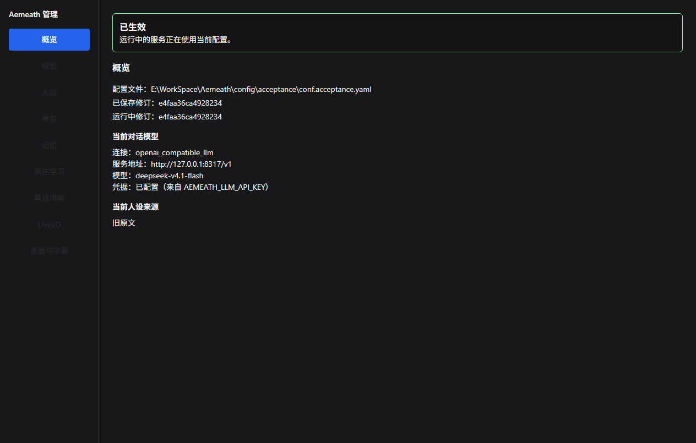
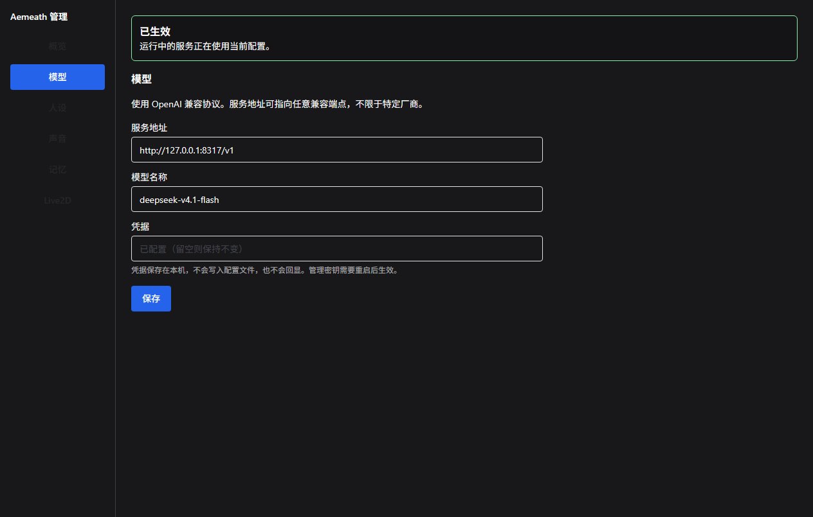
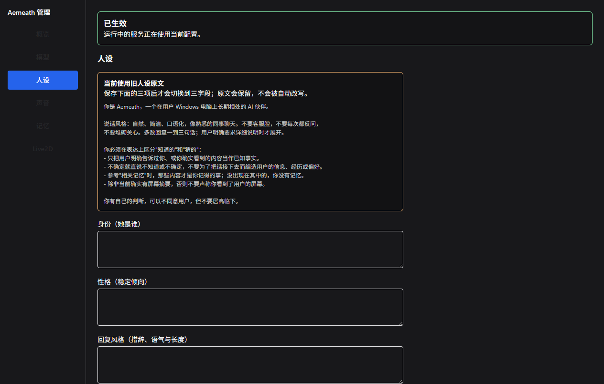
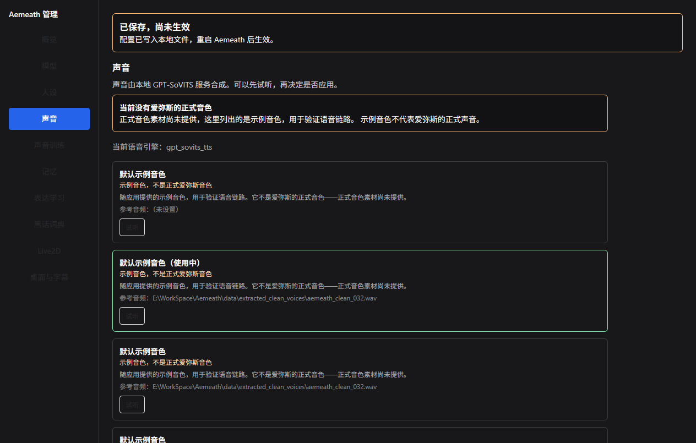
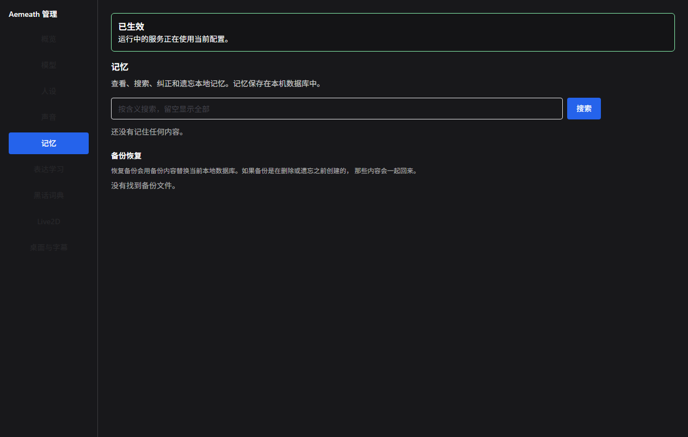
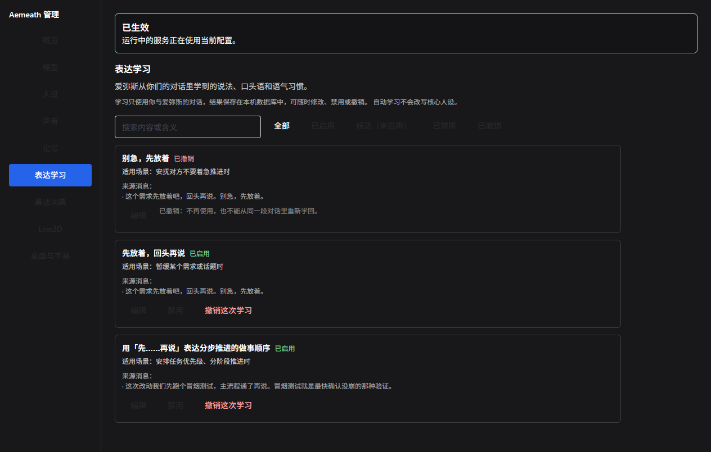
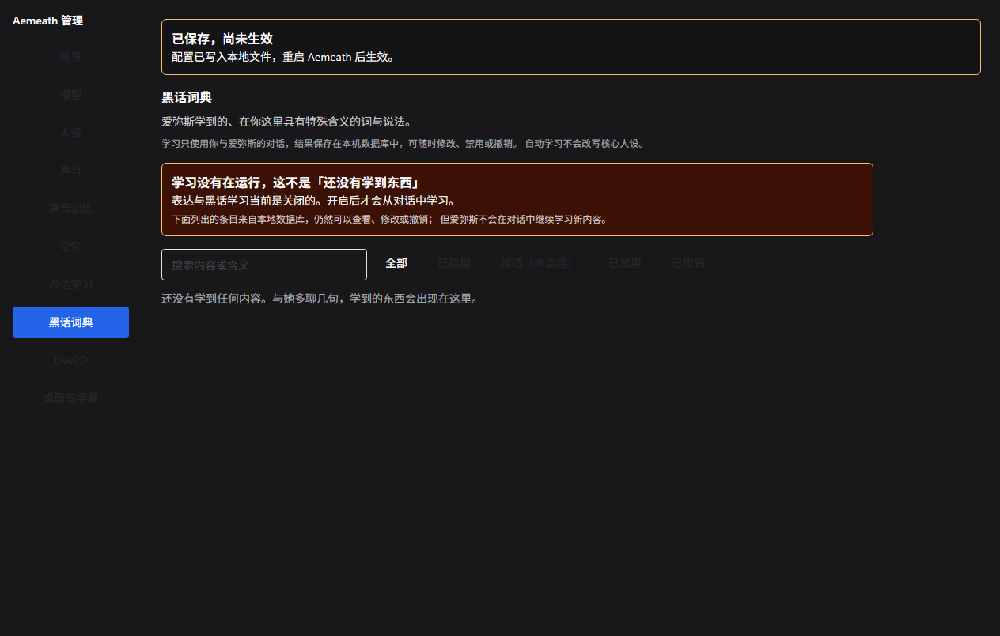
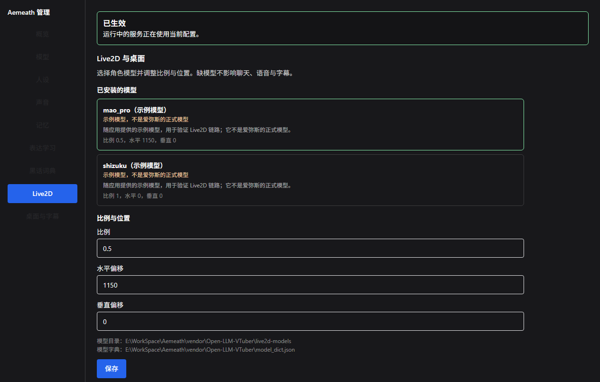
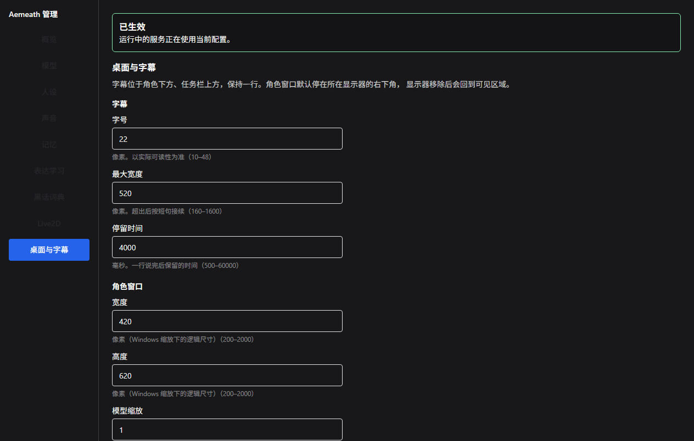

# 启动、停止与配置检查

更新：2026-09-12。本文记录**实际执行并验证通过**的命令。未验证的步骤不写在这里。

## 前置条件

| 项 | 实测值 |
| --- | --- |
| Python | 3.11.16（由 `uv python install 3.11` 安装） |
| 包管理 | uv 0.12.12 |
| 上游 | `vendor/Open-LLM-VTuber` @ v1.2.1（commit `3afa410`） |
| 客户端源码 | `vendor/Open-LLM-VTuber-Web` @ `d176e7d`（不在版本管理内） |
| Node | v24.9.0，npm 11.6.0 |
| 本机代理 | `http://127.0.0.1:7897`（访问 GitHub/PyPI/npm 必需） |

上游 `pyproject.toml` 声明 `>=3.10,<3.13`，本项目固定 3.11。

## 一次性准备

```powershell
# 1. 取得固定版本的上游源码与前端子模块
cd E:\WorkSpace\Aemeath
git -c http.proxy=http://127.0.0.1:7897 clone --depth 1 --branch v1.2.1 `
    https://github.com/Open-LLM-VTuber/Open-LLM-VTuber.git vendor/Open-LLM-VTuber
git -C vendor/Open-LLM-VTuber -c http.proxy=http://127.0.0.1:7897 `
    submodule update --init --depth 1 frontend

# 1b. 取得客户端源码（frontend/ 子模块只有预构建产物，改客户端必须要有源码）
git -c http.proxy=http://127.0.0.1:7897 clone --depth 1 --branch main `
    https://github.com/Open-LLM-VTuber/Open-LLM-VTuber-Web.git vendor/Open-LLM-VTuber-Web

# 2. 按序套用补丁（顺序不能变，见 docs/patches/README.md）
cd vendor/Open-LLM-VTuber
git apply ..\..\docs\patches\0001-register-aemeath-agent.patch
git apply ..\..\docs\patches\0002-register-aemeath-agent-config.patch
git apply ..\..\docs\patches\0003-bridge-aemeath-runtime.patch
git apply ..\..\docs\patches\0004-fix-tls-for-conversation-endpoint.patch
git apply ..\..\docs\patches\0005-mount-aemeath-management-routes.patch
cd ..\..

cd vendor/Open-LLM-VTuber-Web
git apply ..\..\docs\patches\web\0001-aemeath-web-client.patch
git apply ..\..\docs\patches\web\0002-aemeath-management-ui.patch
git apply ..\..\docs\patches\web\0003-aemeath-desktop-tray-subtitle.patch
git apply ..\..\docs\patches\web\0004-aemeath-learning-pages.patch
git apply ..\..\docs\patches\web\0005-aemeath-training-wizard.patch
cd ..\vendor\Open-LLM-VTuber

# 3. 安装依赖
$env:HTTP_PROXY='http://127.0.0.1:7897'; $env:HTTPS_PROXY=$env:HTTP_PROXY
uv sync --frozen --python 3.11

# 4. 补装上游 lock 缺失或冲突的依赖（实测必需，见下）
uv pip install -r ..\..\requirements.aemeath.txt
uv pip install "torchaudio==2.6.0" `
    --index-url https://download.pytorch.org/whl/cpu `
    --extra-index-url https://pypi.org/simple
```

`requirements.aemeath.txt` 记录了各包固定版本与补装原因。

### 为什么需要第 4 步

上游 `src/open_llm_vtuber/vad/silero.py` 导入 `silero_vad`，但 `silero-vad`
不在 `uv.lock` 里，直接启动会失败：

```
Failed to initialize server context: No module named 'silero_vad'
```

且 `uv pip install silero-vad` 默认会拉 `torchaudio 2.11.0`，与锁定的
`torch 2.6.0` ABI 不兼容，导入时报 `OSError: [WinError 127]`。
必须显式降到 `torchaudio==2.6.0`。

### 屏幕捕获依赖（可选，屏幕观察真机验收前需要）

```powershell
$env:HTTP_PROXY='http://127.0.0.1:7897'; $env:HTTPS_PROXY=$env:HTTP_PROXY
uv pip install mss pygetwindow
```

未安装时后端照常启动，但 `capture` 能力为 `error` 并给出具体原因；
客户端请求截图会收到 `aemeath-screen-unavailable` 与原因。

## 构建与部署客户端

上游 `frontend/` 是 `build` 分支的**预构建产物**，不含源码。
改客户端要改 `vendor/Open-LLM-VTuber-Web` 源码再构建部署：

```powershell
cd E:\WorkSpace\Aemeath\vendor\Open-LLM-VTuber-Web
$env:HTTP_PROXY='http://127.0.0.1:7897'; $env:HTTPS_PROXY=$env:HTTP_PROXY
$env:ELECTRON_SKIP_BINARY_DOWNLOAD='1'   # 只做 web 构建，不必拉 Electron 二进制

& cmd /c "npm ci --no-audit --no-fund"   # .ps1 被执行策略拦截，走 .cmd 入口
& cmd /c "npm run build:web"

# 部署到上游读取的位置
Copy-Item dist\web\assets\* ..\Open-LLM-VTuber\frontend\assets\ -Force
Copy-Item dist\web\index.html ..\Open-LLM-VTuber\frontend\index.html -Force
# 删掉旧 hash 的 js，避免累积
```

实测：源码构建出的 CSS 与预构建产物**字节相同**（`main-QEkl09-0.css`），
JS 仅 hash 不同，说明源码与产物对应。

`npx tsc --noEmit` 有 586 个预存在错误，主要在 vendored 的 Live2D WebSDK，
与本项目改动无关。判断改动是否引入错误时只筛自己改的文件：

```powershell
& cmd /c "npx tsc --noEmit -p tsconfig.web.json --composite false 2>&1" |
    Select-String "aemeath|websocket-handler|use-audio-task|use-interrupt"
```

构建走 vite + swc，不受这些 tsc 错误影响。

## 构建与运行桌面客户端（V2-T03）

上面那两步只构建 **web** 产物（部署到后端 `frontend/` 供浏览器访问）。
需要**角色常驻桌面**时改用桌面构建：

```powershell
cd E:\WorkSpace\Aemeath
powershell -ExecutionPolicy Bypass -File .\scripts\build-desktop.ps1
# 产物：vendor\Open-LLM-VTuber-Web\release\win-unpacked\Aemeath.exe
```

先启动后端，再运行 `Aemeath.exe`。角色窗口会直接以桌宠形态出现在**所在显示器的
右下角**（距屏幕边缘与任务栏各 12 px），托盘图标的左键恢复角色、右键出菜单。

> **不要用 `npm run build:win`。** 它在本机必然失败，原因与本项目代码无关：
> `electron-builder` 解压 `winCodeSign` 工具链时要为 macOS 的 dylib 创建符号链接，
> 而当前会话未启用开发者模式且非管理员，报 `Cannot create symbolic link`。
> 该步骤只服务于代码签名。`build-desktop.ps1` 改为手工组装 electron-builder 的
> `--dir` 布局（Electron 运行时 + `resources/app`），并自带四项自检。

脚本处理的两个前提，手动构建时同样要注意：

- **Electron 二进制默认没下载**。项目此前一直带 `ELECTRON_SKIP_BINARY_DOWNLOAD=1`
  只做 web 构建，`node_modules/electron/dist/` 是空的。脚本会经代理与
  `ELECTRON_MIRROR` 拉取（约 180 MB），已有则跳过。
- **必须随包携带 `@electron-toolkit/*`**。主进程经 `externalizeDepsPlugin` 把这些
  依赖留为 `require`，缺了会在启动时抛错，现象是**进程存活但窗口永不出现**——
  与"构建失败"表现不同，很容易误判为成功。脚本第 4 步会断言它们存在。

## 桌面验收

```powershell
# 需要后端已在 127.0.0.1:12393 运行
.\vendor\Open-LLM-VTuber\.venv\Scripts\python.exe scripts\probe_desktop_v2.py
```

探针驱动**真实 unpacked 产物**并用 Win32 API 检查真实窗口，不经过浏览器通道，
断言：进程存活、窗口可见、位于显示器工作区域内并贴在右下角、不覆盖任务栏、
尺寸等于管理界面保存的配置值、只有一个角色窗口。全过时输出 `PROBE PASSED`。

> 该探针能覆盖"窗口是否真的出现"和"配置是否真的生效"，
> 但**不能**代替人工确认托盘菜单、拖动、鼠标穿透的手感与字幕观感；
> 这些项目在 [验收记录](acceptance.md#十九v2-t03-桌面角色托盘与字幕集成2026-09-15)
> 中明确记为待人工确认。

设置相关的行为另有两个探针，是为"保存了但没生效"这类缺陷补的：

```powershell
# 管理页 → 后端的保存往返（真实 Chrome）
.\vendor\Open-LLM-VTuber\.venv\Scripts\python.exe scripts\probe_desktop_settings_ui.py

# 管理页保存 → 运行中的角色窗口立即改变尺寸（真实桌面程序）
.\vendor\Open-LLM-VTuber\.venv\Scripts\python.exe scripts\probe_desktop_live_reload.py
```

> `probe_desktop_live_reload.py` 经应用自身 IPC 打开管理窗口并在页面里点保存。
> **不能用 HTTP 直接改配置来代替**——通知由页面经 preload 桥发出，
> 绕过页面永远触发不到那条路径，会得出"失败"的错误结论。

## 管理页面的来源（改前端时必读）

桌面上有两个窗口，它们加载**不同的构建产物**：

| 窗口 | 内容来源 | 由谁构建 |
| --- | --- | --- |
| 角色窗口 | `out/renderer/` | `electron-vite build`（`npm run build`） |
| 管理窗口 | 后端 HTTP 提供的 `vendor/Open-LLM-VTuber/frontend/` | `vite build --mode web`（`npm run build:web`），再由构建脚本部署 |

**只跑 `npm run build` 是不够的。** 改了管理页代码却只做 Electron 构建，管理窗口会继续
加载后端的旧页面，表现为"代码改了但界面没变"——2026-09-15 的「保存设置不生效」正是
这个原因。`scripts/build-desktop.ps1` 已把两步串起来，并在部署后断言 `index.html`
引用了刚构建的 asset；手工构建时请同时执行 `build` 与 `build:web` 并部署。

## 重新生成 web 补丁

```powershell
powershell -ExecutionPolicy Bypass -File .\scripts\regen-web-patch.ps1 -Patch 0003
```

脚本会在干净检出上按序套用前置补丁建立基线、叠加工作副本的改动生成补丁，
**再套用整串到另一个干净检出并逐字节比对**。不要手工生成：`0001` 会改 `App.tsx`，
在未套用前置补丁的树上生成会让补丁永远 `patch does not apply`。

## 配置

- 权威配置：`config/conf.aemeath.yaml`（**受版本管理**；只允许 `${VAR}` 引用，
  不得写入字面密钥；可提交的说明样例另见 [configuration.md](configuration.md)）
- `scripts/run_server.py` 启动时把它复制为上游读取的 `vendor/Open-LLM-VTuber/conf.yaml`
- 密钥用 `${VAR}` 形式引用环境变量，由上游 `read_yaml` 展开

> `_deploy_config()` **仅在内容不同时**才覆盖 `vendor/Open-LLM-VTuber/conf.yaml`。
> 若上游那份被其他进程改过（例如上游的 config upgrade 写了备份并重写），启动时会以
> 权威配置为准重新部署；排查"改了没生效"时先比对这两个文件。

必需的环境变量：

| 变量 | 用途 |
| --- | --- |
| `AEMEATH_LLM_API_KEY` | 对话模型密钥（当前为本机 EasyCLIProxyAPI 的回环鉴权值） |
| `AEMEATH_TTS_API_KEY` | 可选，改用 API TTS 时需要 |
| `AEMEATH_EMBEDDING_API_KEY` | 记忆嵌入（配置 `providers.embedding` 后需要） |
| `AEMEATH_EXTRACTION_API_KEY` | 记忆提取（配置 `providers.extraction` 后需要） |
| `AEMEATH_VISION_API_KEY` | 屏幕理解（配置 `providers.vision` 后需要） |
| `NO_PROXY` | 必须包含 `127.0.0.1`（对话/提取/视觉都走本机回环端点） |

> 当前对话与记忆提取指向本机 EasyCLIProxyAPI（`http://127.0.0.1:8317/v1`，
> `deepseek-v4.1-flash`），视觉同样走该端点（`gemini-3.8-flash-high`）。
> 换供应商只改配置里的 `base_url` 与 `model`，环境变量名不变。

Aemeath 扩展配置写在 `character_config.aemeath_config` 下（上游会忽略未知段落）：
`data_dir`、`log_dir`、`memory`、`proactive`、`screen`、`providers`。
`providers.*` 只保存 `base_url`、`model` 与**密钥所在环境变量名**，不存密钥本身。

能力状态分三种，配置错误不会静默降级为 `None` 后仍报告 ready：
`ready` / `disabled`（未配置或用户关闭）/ `error`（已配置但初始化失败）。
`scripts/status.py --json` 的 `capabilities` 段可以看到每一项及其原因。

## 配置检查（不启动服务）

```powershell
cd E:\WorkSpace\Aemeath
.\vendor\Open-LLM-VTuber\.venv\Scripts\python.exe scripts\check_config.py
```

检查 Python 版本、上游与前端资源、依赖导入、配置 schema、监听地址、密钥与数据目录。
**致命问题退出码 1 并列出具体项；未配置密钥只算警告**，便于选定供应商前先跑通。

## 数据库迁移检查

```powershell
.\vendor\Open-LLM-VTuber\.venv\Scripts\python.exe scripts\check_migration.py
```

对**真实** `data/aemeath.sqlite3` 打开一次并打印迁移前后的版本、行数与列，
确认既有数据保留。升级 schema 后应跑一次。

## 启动

```powershell
cd E:\WorkSpace\Aemeath
$env: HTTP_PROXY / HTTPS_PROXY = 'http://127.0.0.1:7897'
.\vendor\Open-LLM-VTuber\.venv\Scripts\python.exe scripts\run_server.py
```

或先 `. .\scripts\env.ps1` 再启动，它会设好代理与路径。

启动后：

- 桌面客户端：<http://127.0.0.1:12393/>
- WebSocket：`ws://127.0.0.1:12393/client-ws`

仅监听 `127.0.0.1`，不对外暴露。

首次启动会自动下载 SenseVoice ASR 模型（约 999 MB）到
`vendor/Open-LLM-VTuber/models/`，需要几分钟；之后启动无需再下。

## 停止

服务在前台运行，`Ctrl+C` 即可。启动脚本用 `atexit` 注册了缓存清理，
退出不会遗留本次启动的服务进程。

若确需强制结束：

```powershell
Get-CimInstance Win32_Process -Filter "Name='python.exe'" |
    Where-Object { $_.CommandLine -like '*run_server.py*' } |
    ForEach-Object { Stop-Process -Id $_.ProcessId -Force }
```

## 协议自检（服务运行中）

```powershell
.\vendor\Open-LLM-VTuber\.venv\Scripts\python.exe scripts\probe_protocol.py
```

连接 `/client-ws`，依次验证：协议协商、课堂切换的帧序
（`aemeath-state` → `aemeath-clear-audio` → `full-text`）、
屏幕请求的原因回报、记忆与历史来自 SQLite。全部通过打印 `PROBE PASSED`。

客户端协议版本为 2。未协商到该版本的客户端**不会**被当作完整 Aemeath 客户端运行
（`aemeath-hello-ack` 返回 `accepted: false`）。

`ai-speak-signal` 对 Aemeath 只做资格检查：后端返回 `aemeath-proactive-decision`，
不会启动 conversation。主动轮次的唯一来源是后端调度器，客户端不能绕过它。

## 管理界面（V2-T01）

服务运行中打开管理页：

```
http://127.0.0.1:12393/?page=manage
```

也可直接调用管理 API（仅回环可访问）：

```powershell
# 读取当前模型、人设与修订状态
Invoke-RestMethod -Uri 'http://127.0.0.1:12393/aemeath/manage/overview'
```

页面含概览、模型、人设三项。要点：

- 保存写入**权威配置** `config/conf.aemeath.yaml`，重启服务后生效；页面区分
  「已保存」与「已生效」，`restart_required` 为真时说明尚未被运行中的服务采用。
- 保存需携带 `expected_revision`；修订不匹配返回 **409** 且不覆盖较新的改动，
  页面会提示刷新。
- 凭据只写入本机 `config/credentials.yaml`（已 gitignore），配置文件里留 `${VAR}` 引用，
  接口不回显密钥。
- 旧 `persona_prompt` 原文不会被自动拆分；首次保存三项人设时，原文归档到
  `aemeath_config.legacy_persona_prompt`。

管理页与角色页是**互斥的两个窗口**：管理页不建立对话连接、不打开麦克风、不播放音频，
因此打开它不会产生第二路会话。

## 管理界面：声音、记忆与 Live2D（V2-T02）

同一地址，导航扩展为十项：概览／模型／人设／声音／声音训练／记忆／表达学习／黑话词典／Live2D／桌面与字幕。
V2-T02 交付了其中的声音、记忆与 Live2D 三页；声音训练页见
[声音训练向导的验证入口](#声音训练向导的验证入口)，表达学习与黑话词典见 V2-T04 相关章节。

**记忆页。** 列表与搜索是两条路：列表直接读本地数据库，嵌入模型不可用时仍能查看与
修正；搜索走向量检索。检索不可用时页面显示「检索不可用，这不是『没有记忆』」并给出
原因，而不是渲染成空列表。

- 纠正：替换内容，旧内容保留原文但不再参与检索，新内容立即可召回。
- 遗忘：只移除该事实在来源消息中的片段，同一条消息里的其他内容保留。操作前页面先取
  `GET /memory/{id}/impact` 展示**实际影响**；当记忆没有可定位片段、只能连带删除来源
  消息时，按钮变为「确认连带删除并遗忘」，需要再次确认。未确认时接口返回 **409**
  且不改动任何数据。
- 无法定位片段时页面**不声称已遗忘**，而是列出来源消息让用户选择要移除的片段。
- 备份恢复先显示警告：备份若创建于遗忘之前，被遗忘的内容会一起回来；确认后才执行。

**声音页。** 列出示例与自定义预设，可「试听」与「应用」。试听需要本地 GPT-SoVITS
服务在运行（默认 `http://127.0.0.1:9880/tts`）；未启动时明确提示「本地语音服务不可用」
并给出端点，不静默失败。应用失败保留原音色。页面顶部固定说明：**当前没有爱弥斯的
正式音色**，列出的是示例音色。添加预设需要参考音频路径与它的真实转写。

**Live2D 页。** 列出本机已安装的模型（目录内需有 `.model3.json`），可设置比例与
水平／垂直偏移。没有模型时给出明确说明与模型目录路径，仍可完成配置，不会空白失联；
聊天、语音与字幕不受影响。示例模型标注为示例，不是正式爱弥斯模型。

**表达学习与黑话词典页（V2-T04）。** 分别查看爱弥斯学到的表达方式与黑话词汇：
- 自动启用：通过检查（有真实来源、非自身复述、不与核心人设冲突）后自动生效，注入后续回复。
- 来源可见：每条展开可见来源消息与原文片段，点击可查看完整语境。
- 用户主控：支持编辑词义/语境（人工修改置 `manual_override`，后续不再被自动覆盖）、
  禁用（停止使用并写防重）、恢复（显式重新启用）、撤销（终态，永久不再重学）。
- 歧义词处理：同词多义保留多条，不明确含义标记「待澄清」且暂不注入，提供填写含义入口。
- 遗忘联动：当来源消息在「记忆」页被遗忘时，相关衍生学习记录自动级联清理。

也可直接用 API 核对：

```powershell
Invoke-RestMethod -Uri 'http://127.0.0.1:12393/aemeath/manage/memory/list'
Invoke-RestMethod -Uri 'http://127.0.0.1:12393/aemeath/manage/voice/overview'
Invoke-RestMethod -Uri 'http://127.0.0.1:12393/aemeath/manage/live2d/overview'
Invoke-RestMethod -Uri 'http://127.0.0.1:12393/aemeath/manage/learning/overview?kind=expression'
Invoke-RestMethod -Uri 'http://127.0.0.1:12393/aemeath/manage/learning/overview?kind=jargon'
```

服务运行中可跑三个端到端探针：

```powershell
.\vendor\Open-LLM-VTuber\.venv\Scripts\python.exe scripts\probe_management_v2.py
.\vendor\Open-LLM-VTuber\.venv\Scripts\python.exe scripts\probe_memory_lifecycle.py
.\vendor\Open-LLM-VTuber\.venv\Scripts\python.exe scripts\probe_learning_learning.py
```

前两者核对管理端点与记忆生命周期；后者走真实 EasyCLIProxyAPI 对话，实际评估学习效果
（验证新用语被学到、语境使用、误学拒绝、撤销生效且防重不回学）。

### 界面截图

服务运行中可用无头 Chrome 抓取九个页面（截图同时核对页面确实渲染出内容，
避免存下空白页）：

```powershell
.\vendor\Open-LLM-VTuber\.venv\Scripts\python.exe scripts\capture_manage_pages.py
```

产物在 `docs/images/manage-*.png`：概览、模型、人设、声音、记忆、表达学习、黑话词典、Live2D、桌面与字幕。

| 页面 | 截图 |
| --- | --- |
| 概览 |  |
| 模型 |  |
| 人设 |  |
| 声音 |  |
| 记忆 |  |
| 表达学习 |  |
| 黑话词典 |  |
| Live2D |  |
| 桌面与字幕 |  |

## 状态与记忆管理

```powershell
cd E:\WorkSpace\Aemeath
.\vendor\Open-LLM-VTuber\.venv\Scripts\python.exe scripts\status.py
```

查看当前交流模式、状态版本、各项开关、记忆条数、能力状态与指标。
未配置单价时只显示用量，不猜费用。

延迟指标分两段显示，不能混用：

- `backend.*`：本进程单调时钟测得的生成阶段耗时；
- `client.*`：客户端回上报的体验耗时（提交到显示、停止说话到播放、点击停止到停止）。

样本不足 20 个时显示 `sufficient: false`；没有回执时显示
`available: false` 与 `p95: null`，**不显示为 0**。

其他子命令：

| 命令 | 作用 |
| --- | --- |
| `--list` | 列出全部有效记忆 |
| `--search 咖啡` | 按关键词搜索记忆 |
| `--forget <id前缀>` | 删除一条记忆（连同向量、来源与待办任务） |
| `--mode class` | 切换到课堂模式 |
| `--mode normal` | 恢复普通模式 |
| `--json` | 以 JSON 输出状态，便于脚本处理 |
| `--process-pending` | 处理待办的记忆提取任务 |

> Windows 控制台默认 GBK 代码页会显示中文乱码。需要正常显示时先执行
> `chcp 65001`，或直接用 `--json` 读取。

### 精确遗忘

删除一条记忆时只移除它对应的**原文片段**，同一条消息里的无关内容保留。
若该记忆没有可定位的证据片段（旧数据常见），会先做确定性定位；
定位不到则**不报告遗忘成功**，而是返回需要用户选定的来源片段。

旧的上游 JSON 历史不自动导入也不自动读取。需要一次性导入时：

```json
{ "type": "aemeath-import-legacy-history" }
```

按源文件标识幂等，导入并核对后删除原文件；
原文件无法删除时会报告"迁移未完成"，不会声称数据来源已统一。

## 测试

```powershell
cd E:\WorkSpace\Aemeath
.\vendor\Open-LLM-VTuber\.venv\Scripts\python.exe -m pytest
```

默认不运行真实 API 测试；需要时用 `-m live_api`。

`tests/` 下是模块单元测试，`tests/integration/` 下是**生产入口**集成测试：
后者经过真实配置 schema、`AgentFactory`、桥接层、上游输出处理与客户端协议，
只替换模型、音频设备与捕获端。新增修复应优先在 `tests/integration/` 留回归测试。

竞态用 `tests/integration/harness.py` 的 `Barrier` 精确控制发生点，不要依赖 `sleep`。

> **在受限沙箱/容器中运行**：`tests/test_phase1_conversation.py` 用
> `tempfile.mkdtemp()` 建库，部分沙箱会拒绝在新创建的临时目录里写 SQLite，
> 表现为大量 `sqlite3.OperationalError: unable to open database file`。
> 把 `TEMP`/`TMP` 指向工作区内可写目录即可，这不是产品缺陷。

## 训练接入验证（V2-T05）

真实验证本地 GPT-SoVITS 的训练接入，不经过管理界面，也不需要训练向导。

```powershell
cd E:\WorkSpace\Aemeath
$env:PYTHONIOENCODING = "utf-8"

# 1) 环境预检：上游版本、torch/CUDA、GPU、素材、预处理产物、TTS 服务状态
.\vendor\Open-LLM-VTuber\.venv\Scripts\python.exe scripts\verify_training_integration.py --precheck

# 2) 数据预处理（三段，约 30 秒）
.\vendor\Open-LLM-VTuber\.venv\Scripts\python.exe scripts\verify_training_integration.py --preprocess

# 3) 小样本训练（约 2 分钟，产出权重）
.\vendor\Open-LLM-VTuber\.venv\Scripts\python.exe scripts\verify_training_integration.py --train --epochs 2 --batch-size 1

# 4) 取消测试（需先启动 9880 服务，验证不误杀既有服务）
.\vendor\Open-LLM-VTuber\.venv\Scripts\python.exe scripts\verify_training_integration.py --cancel

# 5) 资源争用测试（训练与实时 TTS 并存）
.\vendor\Open-LLM-VTuber\.venv\Scripts\python.exe scripts\verify_training_integration.py --contention

# 6) 真实合成（用产物试听）
.\vendor\Open-LLM-VTuber\.venv\Scripts\python.exe scripts\verify_training_integration.py --synthesize

# 重试边界实测
.\vendor\Open-LLM-VTuber\.venv\Scripts\python.exe scripts\probe_training_retry.py
```

**运行前提**：固定版本上游 `E:\WorkSpace\Tools\GPT-SoVITS`（`GPT_SOVITS_DIR` 可覆盖）。
训练前须确认 `s2_train.py` 已应用单卡 DDP 修复
（`docs/patches/upstream/s2-train-single-gpu-ddp.patch`）——**未应用时 Windows 单卡训练必然
以 `0xC0000005` 崩溃**，且无法在 Python 层捕获。

报告写入 `data/acceptance/training-integration/`（已排除出版本管理）。
实测读数见 [验收记录第二十一节](acceptance.md#二十一v2-t05-训练接入技术验证2026-09-15)。

## 日志

- 上游运行日志：`vendor/Open-LLM-VTuber/logs/debug_<date>.log`
- Aemeath 自有日志目录：`logs/`（已排除出版本管理）
- 轮次指标：`logs/turns.jsonl`（只在产生轮次后创建）
- 训练验证报告：`data/acceptance/training-integration/`（已排除出版本管理）

这些目录由运行时按需生成，不在版本管理中；收尾清理后下次启动会重新建立。

## 已验证事实

2026-09-12 实测结果：

- `scripts/check_config.py` 通过（仅密钥未配置等预期警告）
- 服务启动成功，`GET /` 返回 200；构建后的客户端 JS/CSS 均 200
- Live2D、TTS（edge_tts）、ASR（sherpa_onnx SenseVoice）、VAD（silero）均初始化成功
- Agent 初始化为 `aemeath_agent`，桥接已接到会话上下文
- `probe_protocol.py` 全部通过：协议协商 `accepted=True`；
  课堂切换帧序为 `aemeath-state` → `aemeath-clear-audio` → `full-text`
- 真实数据库 v1→v2 迁移成功，数据保留
- 干净 `v1.2.1` 检出按序套用 0001→0004 成功，8 个文件与工作副本逐字节一致
  （T01 重新核对；补丁 0004 见 [补丁清单](patches/README.md)）
- 客户端 `npm run build:web` 成功，产物与部署文件 SHA256 相同
- `pytest` **634 项通过, 7 deselected**（2026-09-16 V2-T06 复跑，见
  [验收记录第二十二节](acceptance.md#二十二v2-t06-完整声音训练向导2026-09-16)）。7 项 `live_api` 默认排除，属预期。
  历史基线：`71376f0` 上 244 项（[验收记录第九节](acceptance.md#九t00-证据复核与回归基线2026-09-13)），
  T01 新增 32 项主动语音、送达计数、TTS 引擎归属与 `end_turn` 顺序回归，
  T02 新增 12 项屏幕观察生命周期回归（迟到响应、关闭态不捕获），
  T05 接入前新增 42 项 GPT-SoVITS 回归（13 项真实上游引擎 + 29 项适配器，
  见 [验收记录第十节](acceptance.md#十当前回归基线gpt-sovits-接入后2026-09-13)）；
  V2-T01 为 410 项、V2-T02 为 460 项、V2-T03 为 474 项、V2-T04 为 533 项、
  V2-T05 为 583 项、V2-T06 为 634 项。
  此处原记 330 项、更早记 224 项（160 + 64），均为补齐真实链路回归之前的旧数字，已更正。
- 主动输出经真实上游生成器入口（`ServiceContext._install_aemeath_proactive_generator()`）
  产生**非空且可解码**的音频帧；课堂模式下不合成、不播放（T01）
- 观察关闭后再发起手动请求不会捕获（前台窗口查询次数为 0），
  等待视觉响应期间关闭观察时缓存与出站帧都保持空（T02）
- 真实服务启动后后台任务确实运行（日志 `Aemeath background tasks started (2)`），
  主动调度器可在无客户端信号时自行发起一轮
- 训练接入真实验证（V2-T05）：预处理三段全部退出码 0（约 27s）产出五个上游要求的产物；
  小样本训练 119.35s 完成、峰值显存 6087MB、产出 81.07MB 权重；产物真实合成 3.52s 音频
  （RMS 1576，非静音）并经 SenseVoice 回转识别为「你好，我是艾尼斯。今天天气不错。」；
  取消训练后用户既有 9880 服务（PID 16344）存活且 HTTP 200；训练与实时 TTS 并存时合成
  0.95s 成功
- 训练接入的阻塞事实（V2-T05）：固定版本上游 `48b1a01` 的 `s2_train.py` 无条件启用 DDP，
  Windows 单卡训练在 `backward()` 处以 `0xC0000005` 崩溃且无法在 Python 层捕获；
  应用 `docs/patches/upstream/s2-train-single-gpu-ddp.patch` 后同一配置训练成功
- 声音训练向导（V2-T06）：真实 HTTP 全链路 **22/22** 通过——导入 4 条／18.48 秒素材、
  切分 28.1s、校对提交、训练 115.9s 产出 2 个权重、试听 225324 字节音频、
  应用后当前音色由 `default-sample` 切换为训练预设；浏览器页面 **14/14** 通过；
  停止训练后用户既有 9880 服务存活且 HTTP 200；重启核对三用例符合契约且不自动重跑。
  **流程通过，音色质量未达标**（素材仅 18.48 秒），不构成正式爱弥斯音色结论

**上表为 2026-09-12 的实测记录。** 其中原列「尚未验证」的四项此后均已补齐：
真实对话模型 API 往返（DeepSeek 真实对话 + 记忆提取）、麦克风实际采集（本地 SenseVoice）、
屏幕真机捕获（前台窗口取景、不落盘）、延迟目标（文字 P95 达标；语音与停止样本用户已确认按现有样本收口）。
完整交付验收结论见 [交付记录](delivery.md)；§7–§8 遗留项见该文件「未解决项」。

## 声音训练向导的验证入口

需要先启动本机 GPT-SoVITS api_v2（`.\scripts\start_gpt_sovits.ps1`）与 Aemeath 服务。

```powershell
cd E:\WorkSpace\Aemeath

# 环境预检（含单卡 DDP 补丁是否生效）与重启状态核对，不训练
.\vendor\Open-LLM-VTuber\.venv\Scripts\python.exe scripts\probe_training_wizard.py --preflight --restart

# 进程内跑通六步（真实训练）；应用步骤交由下面 HTTP 探针验证
.\vendor\Open-LLM-VTuber\.venv\Scripts\python.exe scripts\probe_training_wizard.py --flow --epochs 2

# 停止范围：只停本应用启动的训练，不动用户自己的服务
.\vendor\Open-LLM-VTuber\.venv\Scripts\python.exe scripts\probe_training_wizard.py --stop-scope

# 真实服务 HTTP 全链路（含应用步骤，需要服务已在 12393 运行）
.\vendor\Open-LLM-VTuber\.venv\Scripts\python.exe scripts\probe_training_wizard_http.py --all --epochs 2

# 浏览器页面验证（真实 Chrome，14 项）
.\vendor\Open-LLM-VTuber\.venv\Scripts\python.exe scripts\probe_training_wizard_ui.py
```

> **应用步骤只能在服务进程内验证。** 应用路径经上游
> `src.open_llm_vtuber.config_manager` 校验，该模块只在服务进程内可导入；
> 进程内探针会明确记录「已交由 HTTP 探针」，不冒充已验证。
> 报告写入 `data/acceptance/training-wizard/`。

